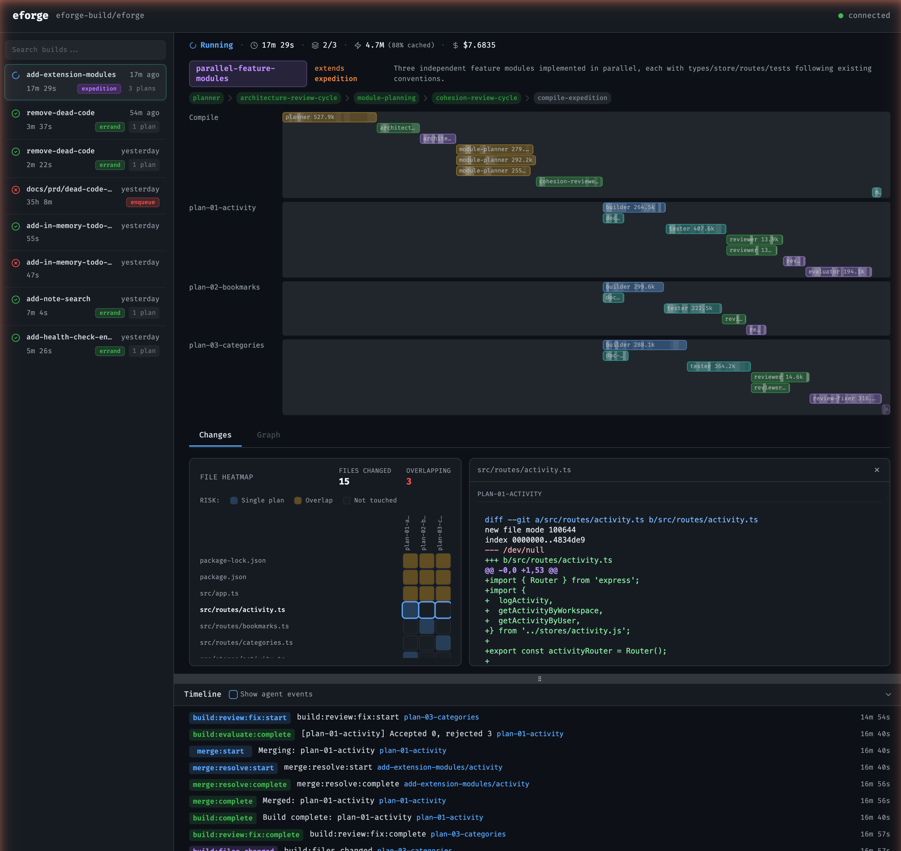

# eforge

[](https://www.npmjs.com/package/eforge)

An agentic build system. You stay at the planning level. Describe what you want built - a prompt, a markdown file, a full PRD - and hand it off. eforge plans the implementation, reviews its own plans, builds, reviews the code, and validates the result.

The name: **E** from the [Expedition-Excursion-Errand methodology](https://www.markschaake.com/posts/expedition-excursion-errand/) + **forge** - shaping code from plans.



> **Status:** This is a young project moving fast. Used daily to build real features (including itself), but expect rough edges - bugs are likely, change is expected, and YMMV. Source is public so you can read, learn from, and fork it. Not accepting issues or PRs at this time.

## What is an Agentic Build System?

Traditional build systems transform source code into artifacts. An agentic build system transforms *specifications* into source code - then verifies its own output.

The key insight: a single AI agent writing and reviewing its own code will almost always approve it. Quality requires **separation of concerns** - distinct agents for planning, building, reviewing, and evaluating, where the reviewer never sees the builder's reasoning and the evaluator judges fixes against the original intent, not the reviewer's confidence.

An agentic build system applies build-system thinking to this multi-agent pipeline:

- **Spec-driven** - Input is a requirement (PRD, prompt, markdown), not a code edit. The system decides *how* to implement it.
- **Multi-stage pipeline** - Planning, implementation, review, and validation are separate stages with separate agents, not one conversation.
- **Blind review** - The reviewer operates without builder context, separating generation from evaluation.
- **Dependency-aware orchestration** - Large work decomposes into modules with a dependency graph. Plans build in parallel across isolated git worktrees, merging in topological order.
- **Adaptive complexity** - The system assesses scope and selects the right workflow: a one-file fix doesn't need architecture review, and a cross-cutting refactor shouldn't skip it.

## Typical Use

Plan a feature interactively in Claude Code, then hand it off with `/eforge:build`. The plugin enqueues the input and a daemon picks it up - planning, building, reviewing, and validating autonomously. A web monitor (default `localhost:4567`) tracks progress, cost, and token usage in real time.


eforge also runs standalone. By default, `eforge build` enqueues and a daemon processes it. Use `--foreground` to run in the current process instead.

## How It Works

**Formatting and enqueue** - Whatever you hand eforge - a prompt, rough notes, a session plan, a detailed PRD - gets normalized into a structured PRD and committed to a queue directory on the current branch. The daemon watches this queue and picks up new PRDs to build.

**Workflow profiles** - The planner assesses complexity and selects a profile:
- **Errand** - Small, self-contained changes. Passthrough compile, fast build.
- **Excursion** - Multi-file features. Planner writes a plan, blind review cycle, then build.
- **Expedition** - Large cross-cutting work. Architecture doc, module decomposition, cohesion review across plans, parallel builds in dependency order.

**Blind review** - Every build gets reviewed by a separate agent with no builder context. Separating generation from evaluation [dramatically improves quality](https://www.anthropic.com/engineering/harness-design-long-running-apps) - solo agents tend to approve their own work regardless. A fixer applies suggestions, then an evaluator accepts strict improvements while rejecting intent changes.

**Parallel orchestration** - Each plan builds in an isolated git worktree. Expeditions run multiple plans in parallel, merging in topological dependency order. Post-merge validation runs with auto-fix.


**Queue and merge** - Completed builds merge back to the branch as ordered commits. When the next build starts from the queue, the planner re-evaluates against the current codebase - so plans adapt to changes that landed since they were enqueued.


For a deeper look at the engine internals, see the [architecture docs](docs/architecture.md). For context on the workflow shift that motivated eforge, see [The Handoff](https://www.markschaake.com/posts/the-handoff/).

## Install

**Prerequisites:** Node.js 22+, Anthropic API key or [Claude subscription](https://claude.ai/upgrade)

Claude Code plugin (recommended):

```
/plugin marketplace add eforge-build/eforge
/plugin install eforge@eforge
```

Standalone CLI:

```bash
npx eforge build "Add rate limiting to the API"
npx eforge build plans/my-feature-prd.md
```

Or install globally: `npm install -g eforge`

## Configuration

Configured via `eforge/config.yaml` (searched upward from cwd), environment variables, and auto-discovered files. Custom workflow profiles, hooks, MCP servers, and plugins are all configurable. See [docs/config.md](docs/config.md) and [docs/hooks.md](docs/hooks.md).

## Development

```bash
pnpm dev          # Run via tsx (pass args after --)
pnpm build        # Bundle with tsup
pnpm test         # Run unit tests
```

### npx convention

The eforge plugin uses `npx -y eforge` to invoke the CLI. This ensures the plugin works for all users regardless of install method - global install, npx, or local development. The `-y` flag auto-confirms install prompts, which is required because the MCP server runs headless and cannot prompt interactively.

### Developer workflow

When developing eforge locally, `pnpm build` compiles the CLI to `dist/cli.js` and makes `eforge` available on PATH via the `bin` entry in `package.json`. After making changes to the engine or CLI, rebuild with `pnpm build` so the daemon picks up the latest code.

To restart the daemon after a local rebuild, use `/eforge:restart` from Claude Code. This calls the daemon's MCP tool to safely stop and restart, checking for active builds first.

For the eforge repository itself, the `/eforge-daemon-restart` project-local skill rebuilds from source and restarts the daemon in one step.

## Evaluation

See [eforge-build/eval](https://github.com/eforge-build/eval) for the end-to-end evaluation harness.

## License

Apache-2.0
