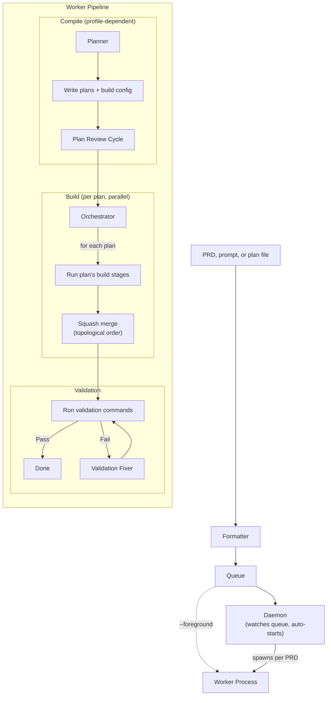

# eforge

An agentic build system. PRD in, reviewed and validated code out.

`eforge` takes a prompt or requirements doc, plans the implementation against your codebase, builds it in isolated git worktrees, runs a blind code review with a fresh-context agent, and validates the result. No supervision required.


## Why

AI coding agents are fast but sloppy. They generate code, ship it, and move on. Nobody reviews. Nobody validates. The result is a growing pile of code that *looks* right but hasn't been stress-tested.

`eforge` treats AI-generated code the way CI/CD treats human-written code: with a structured pipeline that plans, builds, reviews, and validates before anything lands on your branch. The reviewer runs in a fresh context with zero knowledge of how the code was written - it evaluates the output independently. An evaluator then applies per-hunk verdicts on the reviewer's suggestions, accepting strict improvements while rejecting anything that alters intent.

## Install

**Prerequisites:** Node.js 22+, Anthropic API key or [Claude subscription](https://claude.ai/upgrade)

### Claude Code Plugin (recommended)

```
/plugin marketplace add eforge-build/eforge
/plugin install eforge@eforge
```

The first invocation downloads `eforge` automatically via npx. Plan interactively in Claude Code, then hand off to `eforge` for autonomous build, review, and validation.


### Standalone CLI

```bash
npx eforge build "Add a health check endpoint"
```

Or install globally: `npm install -g eforge`

## Quick Start

Give `eforge` a prompt, a markdown file, or a full PRD:

```bash
eforge build "Add rate limiting to the API"
eforge build plans/my-feature-prd.md
```

By default, `eforge build` enqueues the PRD and a daemon automatically picks it up. Use `--foreground` to run in the current process instead.

## How It Works



**Workflow profiles** - The planner assesses complexity and selects a profile:
- **Errand** - Small, self-contained changes. Passthrough compile, fast build.
- **Excursion** - Multi-file features. Planner writes a plan, blind review cycle, then build.
- **Expedition** - Large cross-cutting work. Architecture doc, module decomposition, cohesion review across plans, parallel builds in dependency order.

**Blind review** - Every build gets reviewed by a separate agent with no builder context. A fixer applies suggestions, then an evaluator accepts strict improvements while rejecting intent changes. This is the quality gate.

**Parallel orchestration** - Expedition plans run in isolated git worktrees, merge in topological dependency order, then run post-merge validation with auto-fix.


## The Workflow

The way I actually use `eforge`: plan a feature interactively in Claude Code, then hand it off with `/eforge:build`. The plugin enqueues the PRD and a daemon picks it up automatically — compile, build, review, validate. The daemon serves a web monitor (default `localhost:4567`) where you can watch builds in real time.

I do this throughout the day. Each build lands on main before the next one starts, so later builds plan against the updated codebase, not a stale snapshot.

## Architecture

`eforge` is **library-first**. The engine is a pure TypeScript library that communicates through typed `EforgeEvent`s via `AsyncGenerator` - it never writes to stdout. CLI, web monitor, and Claude Code plugin are thin consumers of the same event stream.

Each build phase gets its own agent role: formatter, planner, builder, reviewer, evaluator, fixer, doc-updater, validation-fixer. Agent runners use an `AgentBackend` interface - all LLM interaction is isolated behind a single adapter, making the engine provider-swappable.

A web monitor records all events to SQLite and serves a real-time dashboard over SSE, tracking progress, cost, and token usage.

## Evaluation

An end-to-end eval harness runs `eforge` against embedded fixture projects and validates the output compiles and tests pass.

```bash
./eval/run.sh                        # Run all scenarios
./eval/run.sh todo-api-health-check  # Run one scenario
```


## Configuration

Configured via `eforge.yaml` (searched upward from cwd), environment variables, and auto-discovered files. Custom workflow profiles, hooks, MCP servers, and plugins are all configurable. See [docs/config.md](docs/config.md) and [docs/hooks.md](docs/hooks.md).

## Status

`eforge` is a personal tool that I use daily to build real features (including itself). Source is public so you can read, learn from, and fork it. Not accepting issues or PRs at this time.

## Development

```bash
pnpm dev          # Run via tsx (pass args after --)
pnpm build        # Bundle with tsup
pnpm test         # Run unit tests
```

## Name

**E** from the [Expedition-Excursion-Errand methodology](https://www.markschaake.com/posts/expedition-excursion-errand/) + **forge** - shaping code from plans.

## License

Apache-2.0
