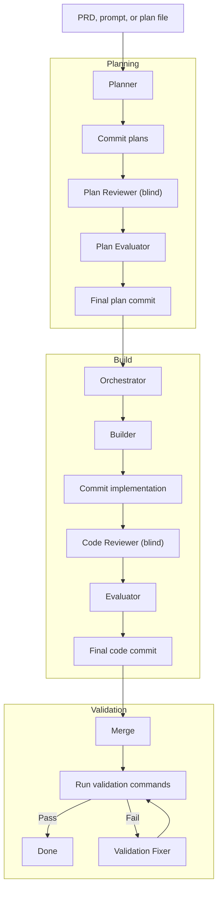

# eforge

Autonomous plan-build-review CLI for code generation.

The name combines **E** from the [Expedition-Excursion-Errand (EEE) methodology](https://www.markschaake.com/posts/expedition-excursion-errand/) - a scope-aware planning framework that right-sizes AI workflows - with **forge**, reflecting the tool's role in shaping code from plans. eforge assesses your task's scope (errand, excursion, or expedition) and adapts its planning and execution strategy accordingly.

## Why eforge?

AI coding tools can produce code fast, but without structure the quality is unpredictable. A single agent that writes and reviews its own work is like a developer merging their own PRs without review - it works sometimes, but there's no systemic quality guarantee.

Through extensive real-world use with Claude Code, a methodology evolved organically - first as hand-crafted skills, then as a set of battle-tested plugins:

1. **Plan** - a detailed, scope-aware planning session with clarification for ambiguities
2. **Implement** - execute the plan
3. **Blind review** - a fresh context reviews the work with zero knowledge of the builder's reasoning
4. **Evaluate** - control returns to the implementer, who inspects each proposed fix independently. Only **strict improvements** are kept - objective bug fixes, missing null checks, security issues. Anything that alters design intent is rejected.
5. **Validate** - verify against the original plan, fix any failures

The core idea: **you focus on intent and planning; eforge handles the engineering methodology.** You bring the "what" and "why." eforge handles the "how" - structured, independent review cycles that produce consistently high-quality results.

This workflow was battle-tested as Claude Code plugins before being packaged into eforge - a standalone engine and CLI that codifies the methodology. A Claude Code plugin provides integration on top of the CLI, and eforge is designed to work especially well in that context: plan interactively, then hand off to eforge for build, review, and validation. Agents inherit your project's plugins, skills, and MCP servers automatically, and git worktree isolation makes it safe to run multiple eforge builds in parallel on the same project. The engine is backend-flexible - the sole implementation today uses the [Claude Agent SDK](https://docs.anthropic.com/en/docs/agents-and-tools/claude-agent-sdk), but the `AgentBackend` abstraction means it can be extended to support other systems.

## How It Works



- **Planning** - The planner explores the codebase, assesses scope (errand = 1 plan, excursion = 2-3, expedition = 4+), asks clarifying questions, and writes plan files. Plans go through a blind review cycle before building starts.
- **Building** - Each plan runs in an isolated git worktree. The builder implements the plan, a blind reviewer proposes fixes in a fresh context, and the evaluator applies per-hunk verdicts - accepting strict improvements while rejecting anything that alters intent.
- **Validation** - Runs configured commands (type-check, tests, linting). If validation fails, a fixer agent attempts minimal repairs automatically.
- **Orchestration** - Multi-plan sets are resolved into a dependency graph, executed in parallel waves, and merged in topological order.

## Getting Started

### Install

**Prerequisites:** Node.js 22+, pnpm, [Claude Max subscription](https://claude.ai/upgrade) (for the Agent SDK backend)

```bash
git clone https://github.com/eforge-run/eforge.git
cd eforge
pnpm install && pnpm build
pnpm link --global
```

### Claude Code Plugin (recommended)

The plugin lets you plan interactively in Claude Code and hand off to eforge for build, review, and validation. It requires the eforge CLI to be installed and on PATH.

Add the marketplace and install from within Claude Code:

```
/plugin marketplace add eforge-run/eforge
/plugin install eforge@eforge
```

Once installed, the primary entrypoint is `/eforge:run` - it takes a PRD or prompt and handles planning, building, review, and validation end-to-end.

| Skill | Description |
|-------|-------------|
| `/eforge:run` | Plan + build + validate in one step |
| `/eforge:status` | Check build progress |

### CLI Usage

```bash
# Generate plans from a PRD or description
eforge plan docs/my-feature.md
eforge plan "Add a health check endpoint"

# Plan + build + validate in one step
eforge run docs/my-feature.md

# Execute plans (implement + review + validate)
eforge build my-plan-set

# Check running builds
eforge status

# Start or connect to the monitor dashboard
eforge monitor
```

Each command supports `--help` for the full list of options. Common flags:

| Flag | Description |
|------|-------------|
| `--auto` | Bypass approval gates |
| `--verbose` | Stream agent output |
| `--dry-run` | Validate without executing |
| `--no-monitor` | Disable web monitor |
| `--no-plugins` | Disable plugin loading |

## Configuration

eforge is configured via `eforge.yaml` (searched upward from cwd), environment variables, and auto-discovered files.

### `eforge.yaml`

All fields are optional. Defaults are shown:

```yaml
plugins:
  enabled: true               # Auto-discover Claude Code plugins
  # include:                  # Allowlist - only load these (plugin identifiers)
  #   - "git@schaake-cc-marketplace"
  # exclude:                  # Denylist - skip these from auto-discovery
  #   - "ui@schaake-cc-marketplace"
  # paths:                    # Additional local plugin directories
  #   - /path/to/custom-plugin

agents:
  maxTurns: 30                # Max agent turns before stopping
  permissionMode: bypass      # 'bypass' or 'default'
  settingSources:             # Which Claude Code settings to load (user, project, local)
    - project                 # Loads CLAUDE.md and project settings

build:
  parallelism: <cpu-count>    # Max parallel plan executions
  maxValidationRetries: 2     # Fix attempts on validation failure (0 = no retries)
  cleanupPlanFiles: true      # Remove plan files after successful build
  # worktreeDir: /custom/path # Override worktree base directory
  # postMergeCommands:        # Extra validation commands (appended to planner-generated ones)
  #   - "pnpm install"
  #   - "pnpm type-check"
  #   - "pnpm test"

plan:
  outputDir: plans            # Where plan artifacts are written

langfuse:
  # publicKey: lf_pk_...      # Or set LANGFUSE_PUBLIC_KEY env var
  # secretKey: lf_sk_...      # Or set LANGFUSE_SECRET_KEY env var
  host: https://cloud.langfuse.com  # Or set LANGFUSE_BASE_URL env var
```

### MCP Servers

MCP servers are auto-loaded from `.mcp.json` in the project root (same format Claude Code uses). All agents receive the same MCP servers.

```json
{
  "mcpServers": {
    "brain": {
      "command": "npx",
      "args": ["brain-mcp-server"],
      "env": { "BRAIN_DB": "/path/to/db" }
    }
  }
}
```

### Plugins

Plugins are auto-discovered from `~/.claude/plugins/installed_plugins.json`. Both user-scoped (global) and project-scoped plugins matching the working directory are loaded. Plugins provide skills, hooks, and MCP servers to eforge's agents.

Use `plugins.include`/`plugins.exclude` in `eforge.yaml` to filter, or `--no-plugins` to disable entirely.

## Architecture

eforge is **library-first**. The engine (`src/engine/`) is a pure TypeScript library that communicates exclusively through typed `EforgeEvent`s via `AsyncGenerator` - it never writes to stdout. The CLI and web monitor are thin consumers that iterate the event stream and render.

Agent runners use the `AgentBackend` interface - all SDK interaction is isolated behind a single adapter (`src/engine/backends/claude-sdk.ts`). New surfaces (CI, TUI, web) consume the same event stream.

A real-time web monitor records all events to SQLite and serves a dashboard over SSE, auto-starting with `plan`, `build`, and `run` commands.

## Evaluation

An end-to-end eval harness lives in `eval/`. It runs eforge against embedded fixture projects and validates the output compiles and tests pass.

```bash
./eval/run.sh                        # Run all scenarios
./eval/run.sh todo-api-health-check  # Run one scenario
./eval/run.sh --dry-run              # Smoke-test the harness
```

See `eval/scenarios.yaml` for the scenario manifest and `eval/fixtures/` for the test projects.

## Development

```bash
pnpm dev          # Run via tsx (pass args after --)
pnpm build        # Bundle with tsup
pnpm type-check   # Type check
pnpm test         # Run unit tests
```

## License

Apache-2.0
