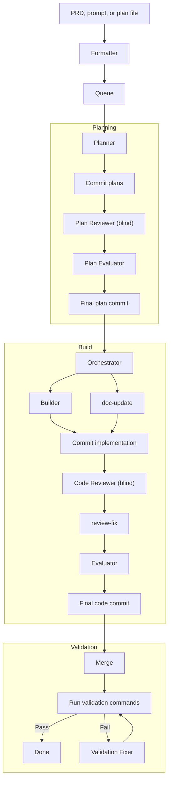

# eforge

An autonomous build engine with blind review. Express intent, eforge plans, implements, reviews, and validates - no supervision required.

eforge builds itself.


## Install

**Prerequisites:** Node.js 22+, Anthropic API key or [Claude subscription](https://claude.ai/upgrade)

### Claude Code Plugin (recommended)

```
/plugin marketplace add eforge-run/eforge
/plugin install eforge@eforge
```

The first invocation downloads eforge automatically via npx - no global install needed. Plan interactively in Claude Code, then hand off to eforge for build, review, and validation.

| Skill | Description |
|-------|-------------|
| `/eforge:run` | Enqueue + compile + build + validate in one step |
| `/eforge:enqueue` | Normalize input and add to queue |
| `/eforge:status` | Check build progress |
| `/eforge:config` | Initialize or edit `eforge.yaml` with interactive guidance |

### Standalone CLI

```bash
npx eforge run "Add a health check endpoint"
```

Or install globally with `npm install -g eforge`.

## Quick Start

Give eforge a prompt, a markdown file, or a full PRD - it handles the rest:

```bash
eforge run "Add a health check endpoint"
eforge run docs/my-feature.md
```

eforge plans the work, builds it in an isolated worktree, runs a blind code review with a fresh-context agent, evaluates the reviewer's suggestions, merges, and validates. Every phase produces a git commit so the full lifecycle is traceable in history.


## How It Works



- **Planning** - The planner explores the codebase, selects a workflow profile (errand = 1 plan, excursion = 2-3, expedition = 4+), asks clarifying questions, and writes plan files. If the work is already complete, the planner emits a skip signal and exits early. Plans go through a blind review cycle before building starts.
- **Building** - Each plan runs in an isolated git worktree. The builder implements the plan, a blind reviewer proposes fixes in a fresh context, and the evaluator applies per-hunk verdicts - accepting strict improvements while rejecting anything that alters intent.
- **Validation** - Runs configured commands (type-check, tests, linting). If validation fails, a fixer agent attempts minimal repairs automatically.
- **Orchestration** - Multi-plan sets are resolved into a dependency graph, executed in parallel waves, and merged in topological order.


## Why Blind Review?

A single agent writing and reviewing its own work is a developer merging their own PRs. eforge enforces separation - the builder and reviewer are independent agents with no shared context. The reviewer can't be primed by the builder's reasoning, so it catches what a self-reviewing agent won't.

## Status

eforge is a personal tool - source is public so you can read, learn from, and fork it. Not accepting issues or PRs.

## CLI Usage

```bash
# Normalize input and add to the PRD queue
eforge enqueue docs/my-feature.md

# Enqueue + compile + build + validate in one step
eforge run docs/my-feature.md
eforge run "Add a health check endpoint"

# Process all PRDs from the queue
eforge run --queue

# Watch queue and process new PRDs as they arrive
eforge run --queue --watch

# Check running builds
eforge status

# List PRDs in the queue
eforge queue list

# Process specific PRD from the queue
eforge queue run my-feature

# Watch queue for new PRDs
eforge queue run --watch

# Validate eforge.yaml configuration
eforge config validate

# Show resolved configuration (all layers merged)
eforge config show

# Start or connect to the monitor dashboard
eforge monitor
```

Each command supports `--help` for the full list of options. Common flags:

| Flag | Description |
|------|-------------|
| `--auto` | Bypass approval gates |
| `--verbose` | Stream agent output |
| `--dry-run` | Validate without executing |
| `--queue` | Process all PRDs from the queue |
| `--watch` | Watch queue for new PRDs (with `--queue`) |
| `--poll-interval <ms>` | Poll interval for watch mode (default 5000) |
| `--no-monitor` | Disable web monitor server (events still recorded) |
| `--no-plugins` | Disable plugin loading |
| `--no-generate-profile` | Disable custom profile generation (enabled by default) |

## Configuration

eforge is configured via `eforge.yaml` (searched upward from cwd), environment variables, and auto-discovered files.

### `eforge.yaml`

All fields are optional. Defaults are shown:

```yaml
plugins:
  enabled: true               # Auto-discover Claude Code plugins
  # include:                  # Allowlist - only load these (plugin identifiers)
  # exclude:                  # Denylist - skip these from auto-discovery
  # paths:                    # Additional local plugin directories

agents:
  maxTurns: 30                # Max agent turns before stopping
  permissionMode: bypass      # 'bypass' or 'default'
  settingSources:             # Which Claude Code settings to load
    - project                 # Loads CLAUDE.md and project settings

build:
  parallelism: <cpu-count>    # Max parallel plan executions
  maxValidationRetries: 2     # Fix attempts on validation failure (0 = no retries)
  cleanupPlanFiles: true      # Remove plan files after successful build
  # worktreeDir: /custom/path # Override worktree base directory
  # postMergeCommands:        # Extra validation commands
  #   - "pnpm type-check"
  #   - "pnpm test"

plan:
  outputDir: plans            # Where plan artifacts are written

prdQueue:
  dir: docs/prd-queue         # Where queued PRDs are stored
  autoRevise: false           # Auto-revise PRDs on enqueue
```

### MCP Servers

MCP servers are auto-loaded from `.mcp.json` in the project root (same format Claude Code uses). All agents receive the same MCP servers.

### Plugins

Plugins are auto-discovered from `~/.claude/plugins/installed_plugins.json`. Both user-scoped and project-scoped plugins matching the working directory are loaded. Use `plugins.include`/`plugins.exclude` in `eforge.yaml` to filter, or `--no-plugins` to disable entirely.

### Hooks

Hooks are fire-and-forget shell commands triggered by eforge events - useful for logging, notifications, and external system integration. They do not block or influence the pipeline. See [docs/hooks.md](docs/hooks.md) for configuration and details.

## Architecture

eforge is **library-first**. The engine (`src/engine/`) is a pure TypeScript library that communicates exclusively through typed `EforgeEvent`s via `AsyncGenerator` - it never writes to stdout. The CLI and web monitor are thin consumers that iterate the event stream and render.

Agent runners use the `AgentBackend` interface - all SDK interaction is isolated behind a single adapter (`src/engine/backends/claude-sdk.ts`). New surfaces (CI, TUI, web) consume the same event stream.

A real-time web monitor records all events to SQLite and serves a dashboard over SSE, auto-starting with `run` commands. Recording is decoupled from the web server - events are always persisted, even with `--no-monitor` or `enqueue`.

## Evaluation

An end-to-end eval harness lives in `eval/`. It runs eforge against embedded fixture projects and validates the output compiles and tests pass.

```bash
./eval/run.sh                        # Run all scenarios
./eval/run.sh todo-api-health-check  # Run one scenario
./eval/run.sh --dry-run              # Smoke-test the harness
```

See `eval/scenarios.yaml` for the scenario manifest and `eval/fixtures/` for the test projects.


## Development

```bash
pnpm dev          # Run via tsx (pass args after --)
pnpm build        # Bundle with tsup
pnpm type-check   # Type check
pnpm test         # Run unit tests
```

## Name

**E** from the [Expedition-Excursion-Errand (EEE) methodology](https://www.markschaake.com/posts/expedition-excursion-errand/) + **forge** - shaping code from plans.

## License

Apache-2.0
