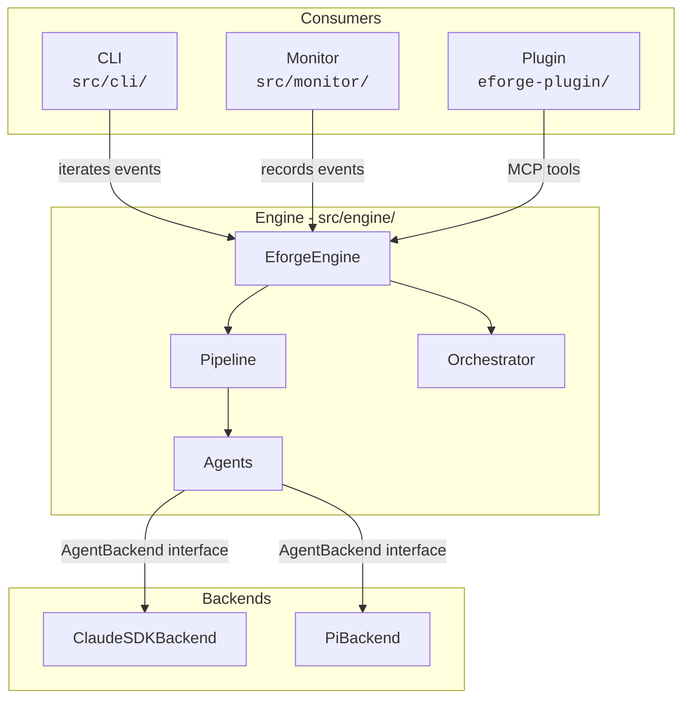
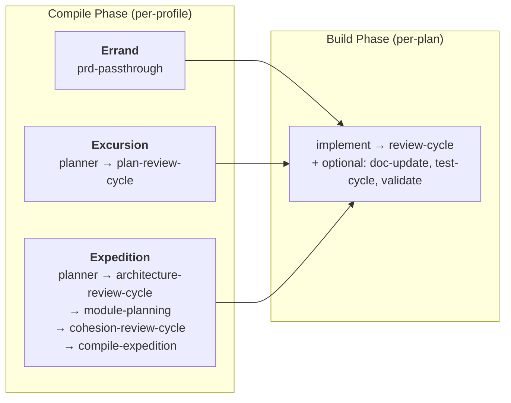
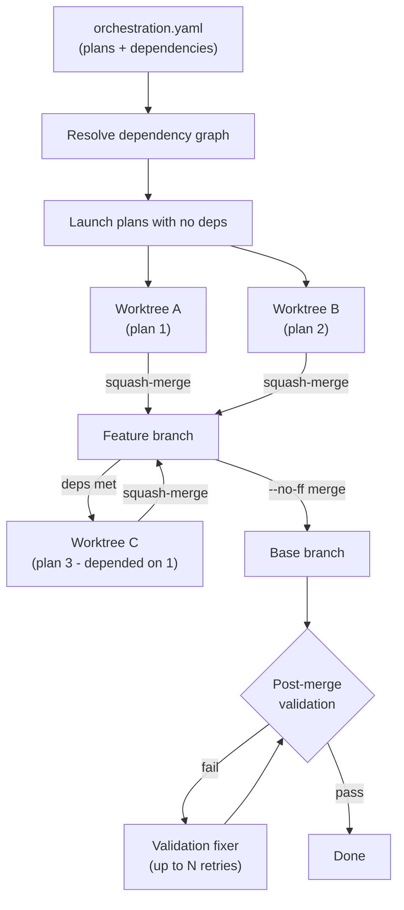

# Architecture

eforge is **library-first**. The engine is a pure TypeScript library that communicates through typed `EforgeEvent`s via `AsyncGenerator` - it never writes to stdout. CLI, web monitor, and Claude Code plugin are thin consumers of the same event stream.

## System Layers

### Engine

`src/engine/` is the library core. The public API is the `EforgeEngine` class, which exposes methods for compiling, building, enqueueing, and queue processing - all returning `AsyncGenerator<EforgeEvent>`.

### CLI

`src/cli/` is a thin consumer. Parses arguments via Commander, iterates the engine's event stream, and renders to the terminal. Also manages the daemon process and handles interactive clarification prompts.

### Monitor

`src/monitor/` provides the web dashboard. Events are recorded to SQLite via transparent middleware - this runs even with `--no-monitor`. The web server serves a React UI over SSE, runs as a detached process, and survives CLI exit.

### Plugin

`eforge-plugin/` is the Claude Code integration. It exposes MCP tools that communicate with the daemon via `mcp__eforge__eforge_*` tool calls for build, queue, status, config, and daemon operations.

## Event System

`EforgeEvent` is a discriminated union. All event types follow a `category:action` naming pattern. Major categories:

| Category | Purpose |
|----------|---------|
| `session:*` / `phase:*` | Lifecycle boundaries |
| `plan:*` | Planning, plan review, architecture review, cohesion review |
| `build:*` | Implementation, code review, fix, evaluate, doc-update, test |
| `schedule:*` / `merge:*` | Orchestration scheduling and merge sequencing |
| `expedition:*` | Expedition-specific planning phases |
| `agent:*` | Agent lifecycle and streaming |
| `validation:*` | Post-merge validation |
| `queue:*` / `enqueue:*` | PRD queue operations |
| `prd_validation:*` | PRD validation (`prd_validation:start`, `prd_validation:complete`) |
| `reconciliation:*` | Reconciliation (`reconciliation:start`, `reconciliation:complete`) |
| `cleanup:*` | Cleanup (`cleanup:start`, `cleanup:complete`) |
| `approval:*` | Approval flow (`approval:needed`, `approval:response`) |

The CLI composes async generator middleware around the engine's event stream - transformers that stamp session/run IDs, fire hooks, and record to SQLite without altering the events themselves.

## Pipeline

The engine uses a two-phase pipeline. Each phase is a sequence of named stages - async generators registered in a global stage registry.

- **Compile stages** run once per build. The stage list is declared per-profile.
- **Build stages** run once per plan. The stage list is per-plan, stored in `orchestration.yaml`.

### Compile stages

| Stage | Description |
|-------|-------------|
| `prd-passthrough` | Passes PRD directly as a single plan - no agent planning |
| `planner` | Agent explores codebase, selects profile, writes plan files and `orchestration.yaml` |
| `plan-review-cycle` | Blind review of plans against PRD, with fix and evaluate loop |
| `architecture-review-cycle` | Reviews architecture doc for module boundary soundness and integration contracts |
| `module-planning` | Writes detailed plans for each module using architecture context |
| `cohesion-review-cycle` | Reviews cross-module plan cohesion for consistency and integration gaps |
| `compile-expedition` | Compiles module plans into final plan files and orchestration |

### Build stages

| Stage | Description |
|-------|-------------|
| `implement` | Builder agent codes the plan, runs verification, commits changes |
| `review-cycle` | Composite: expands to `review` -> `review-fix` -> `evaluate` |
| `doc-update` | Updates documentation to reflect implementation changes |
| `test-write` | Writes tests from the plan spec (TDD - runs before `implement`) |
| `test-cycle` | Composite: expands to `test` -> `test-fix` -> `evaluate` |
| `validate` | Runs validation commands (compile, test, lint) |

Build stages support parallel groups - arrays in the stage list run concurrently. For example, `[['implement', 'doc-update'], 'review-cycle']` runs implement and doc-update in parallel, then review-cycle after both complete.

## Workflow Profiles

Profiles control which compile stages run. The planner assesses input complexity and selects a profile, or the user can specify one explicitly.

**Errand** - Small, self-contained changes. Compile: `[prd-passthrough]`. Skips planning entirely - the PRD becomes the plan.

**Excursion** - Multi-file feature work. Compile: `[planner, plan-review-cycle]`. Single planning pass covers all files and dependencies.

**Expedition** - Large cross-cutting work. Compile: `[planner, architecture-review-cycle, module-planning, cohesion-review-cycle, compile-expedition]`. Decomposes work into modules, each planned independently with architecture and cohesion review across the set.

Custom profiles can be defined in `eforge/config.yaml` with `extends` chains for incremental customization. See [config.md](config.md) for details.

## Agents

Agents are stateless async generators. Each accepts options (including an `AgentBackend`) and yields `EforgeEvent`s. Agents never import AI SDKs directly - all LLM interaction goes through the `AgentBackend` interface.

Two backend implementations exist:
- **ClaudeSDKBackend** - uses `@anthropic-ai/claude-agent-sdk`
- **PiBackend** - uses pi-mono for multi-provider support (OpenAI, Google, Mistral, and more)

Agent roles by function:

| Function | Roles |
|----------|-------|
| **Planning** | formatter, planner, module-planner, staleness-assessor, prd-validator, dependency-detector |
| **Building** | builder, doc-updater, test-writer, tester |
| **Review** | reviewer, parallel-reviewer, review-fixer, plan-evaluator, cohesion-reviewer, architecture-reviewer |
| **Recovery** | validation-fixer, merge-conflict-resolver |

Per-role configuration (model, thinking mode, effort level, budget, tool filters) is set via `eforge/config.yaml` under `agents.roles`. See [config.md](config.md).

### Blind review

Quality requires separating generation from evaluation. The reviewer operates without builder context - it sees only the code diff, not the builder's reasoning. The review-fixer applies suggested fixes as unstaged changes. The evaluator then judges each fix against the original plan intent, accepting strict improvements and rejecting changes that alter intent. This same three-step pattern (blind review -> fix -> evaluate) applies to plan review, architecture review, and cohesion review.

## Orchestration

`orchestration.yaml` (written during compile) defines plans with a dependency graph. The orchestrator uses a **greedy scheduling algorithm** - each plan launches as soon as all its dependencies have merged, without waiting for a full "wave" to complete.

Each plan builds in an **isolated git worktree**. Worktrees live in a sibling directory to avoid polluting the main repo. A semaphore limits concurrent plan execution (configurable via `build.parallelism`).

When a plan completes and merges, the orchestrator immediately checks if any pending plans now have all dependencies satisfied, and launches them. Plans squash-merge back to the feature branch as they finish - a plan only merges after all its dependencies have merged. If a merge conflict occurs, the merge-conflict-resolver agent attempts resolution using context from both plans. After all plans merge, the feature branch merges to the base branch via `--no-ff`, creating a merge commit that preserves the full branch history while keeping the base branch's first-parent history clean.

**Post-merge validation** runs commands from `orchestration.yaml` (planner-generated) and `eforge/config.yaml` `postMergeCommands` (user-configured). On failure, the validation-fixer agent attempts repairs up to a configurable retry limit.

Build state is persisted to disk, enabling **resume** after interruption. On resume, completed plans are skipped and in-progress plans restart.

## Queue and Daemon

PRDs are enqueued as `.md` files with YAML frontmatter in `eforge/queue/`. Frontmatter carries metadata like title, priority, dependencies, and status. The queue resolves processing order via topological sort on dependencies, then by priority and creation time.

The **daemon** (`eforge daemon start`) is a long-running process that watches the queue directory. When a new PRD appears, the daemon claims it via an atomic lock file (prevents double-processing across concurrent workers), runs a staleness check against the current codebase, and processes it through the compile-build pipeline.

**Auto-build** mode (default) automatically processes PRDs on enqueue. The daemon spawns a worker process for each build, tracking progress via SQLite. Failed builds pause auto-build until manually restarted. The daemon shuts down after a configurable idle timeout.

## Monitor

The web monitor tracks cost, token usage, and progress in real time on a dynamically assigned port.

**Recording** is decoupled from the dashboard. Every `EforgeEvent` is written to SQLite regardless of whether the web server is running. This means event history is always available for inspection.

The **web server** runs as a detached process that survives CLI exit. It polls SQLite for new events and pushes them to the dashboard via Server-Sent Events (SSE). The server stays alive after the last active session ends so browser users can inspect results before it exits.
