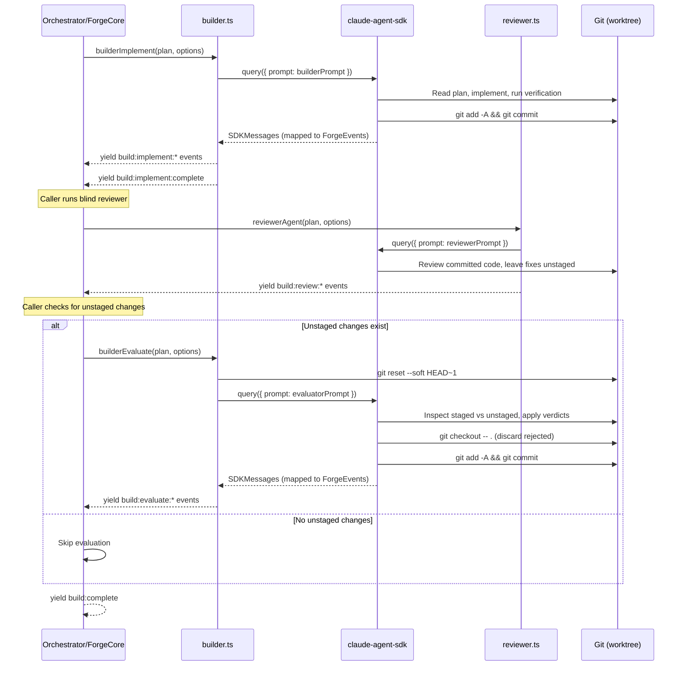

# Builder

## Architecture Reference

This module implements the **builder** agent from the architecture — the multi-turn SDK client that implements plans and evaluates reviewer fixes (Wave 2, parallel with planner/reviewer/orchestration/config).

Key constraints from architecture:
- Builder wraps a multi-turn SDK `query()` call using `streamInput()` for turn 2
- Turn 1: implement plan, commit all changes
- Turn 2: evaluate reviewer's unstaged fixes (accept strict improvements, reject intent-altering changes)
- Between turns: blind reviewer runs as a separate one-shot `query()` (no builder context), then `git reset --soft HEAD~1` creates staged=implementation, unstaged=fixes
- Builder yields `ForgeEvent`s via `AsyncGenerator` — never writes to stdout
- Prompts are static `.md` files loaded via `loadPrompt()` from foundation
- SDK messages are mapped to `ForgeEvent`s via `mapSDKMessages()` from foundation

## Scope

### In Scope
- Builder agent function — multi-turn SDK `query()` orchestrating the full implement-review-evaluate lifecycle
- Builder prompt file (`src/engine/prompts/builder.md`) — extracted and adapted from the orchestrate plugin's executor prompt
- Evaluator prompt file (`src/engine/prompts/evaluator.md`) — extracted and adapted from the review plugin's fix-evaluation-policy
- Git operations for the evaluate phase — `git reset --soft HEAD~1`, `git checkout -- .`, `git diff` for inspecting unstaged changes
- Fix evaluation result parsing — extract accept/reject/review verdicts from evaluator agent output
- Event emission for all build lifecycle stages (`build:start` through `build:complete`/`build:failed`)
- AbortController integration for cancellation support
- Error handling and cleanup (ensure worktree is left in a clean state on failure)

### Out of Scope
- Reviewer agent implementation (separate one-shot query) --> reviewer module
- Orchestrator / worktree lifecycle / wave execution --> orchestration module
- Plan file parsing, `ForgeEvent` types, SDK message mapping --> foundation module (dependency)
- `ForgeEngine` integration (wiring `build()` method) --> forge-core module
- CLI display, approval gates --> cli module
- Prompt loading utility (`loadPrompt()`) --> foundation module (dependency)

## Dependencies

| Module | Dependency Type | Notes |
|--------|-----------------|-------|
| foundation | Required | `ForgeEvent` types, `mapSDKMessages()`, `loadPrompt()`, `PlanFile`, `ReviewIssue`, `BuildOptions` |

### External Dependencies

| Package | Version | Purpose |
|---------|---------|---------|
| `@anthropic-ai/claude-agent-sdk` | ^0.2.74 | `query()`, `Query.streamInput()`, `SDKMessage` types, `SDKUserMessage` |

## Implementation Approach

### Overview

Two files: the builder agent (`src/engine/agents/builder.ts`) and two prompt files (`src/engine/prompts/builder.md`, `src/engine/prompts/evaluator.md`). The builder agent is an async generator function that yields `ForgeEvent`s across a three-phase lifecycle: implement, review (delegates to the reviewer module), and evaluate.

The builder does NOT spawn the reviewer itself — it yields control back to the caller (orchestrator or forge-core) between turns, allowing the caller to run the blind reviewer and then resume the builder for evaluation. This keeps the builder focused on its two turns and avoids coupling to the reviewer implementation.

### Key Decisions

1. **Builder yields control between turns** rather than internally spawning the reviewer. The caller (orchestrator/forge-core) runs the blind reviewer between builder turn 1 and turn 2. This matches the architecture's separation of concerns — the builder owns implementation and evaluation, the reviewer is independent.

2. **Two-function design**: `builderImplement()` for turn 1 (implement plan) and `builderEvaluate()` for turn 2 (evaluate fixes). These are separate async generator functions, not a single multi-turn query. Rationale: the SDK's `streamInput()` requires the same `Query` instance to stay alive across turns, but between turns the blind reviewer runs (potentially minutes), and keeping the SDK process alive that long wastes resources. Separate queries are simpler and more robust.

3. **Evaluator uses structured output parsing** — the evaluator prompt instructs the agent to output verdicts in a parseable `<evaluation>` XML format (similar to how the planner uses `<clarification>` XML). The builder parses these to compute accept/reject/review counts for the `build:evaluate:complete` event.

4. **Git operations are shell commands** executed via the SDK agent's Bash tool (in the evaluator prompt), not via Node.js `child_process`. The evaluator agent runs `git reset --soft HEAD~1`, inspects diffs, applies verdicts, and runs `git checkout -- .` to discard rejected changes — all within its SDK session.

5. **Builder prompts are self-contained** — they include the plan content directly (loaded and interpolated by the caller), not references to plan file paths. This eliminates the need for the SDK agent to read plan files itself, reducing tool calls and improving reliability.

6. **Error handling wraps the entire lifecycle** — if the implement phase fails, the builder emits `build:failed` and returns. If the evaluate phase fails, the builder still emits `build:failed` but ensures the worktree is left with the implementation commit intact (no partial state).

### Multi-Turn Lifecycle



### Evaluation XML Format

The evaluator agent outputs structured verdicts:

```xml
<evaluation>
  <verdict file="src/api/auth.ts" action="accept">
    Missing null check on user.email — prevents runtime crash
  </verdict>
  <verdict file="src/api/auth.ts" action="reject">
    Refactors error handling strategy — design decision, not a bug
  </verdict>
  <verdict file="src/utils/format.ts" action="review">
    Adds explicit return type — correct but debatable
  </verdict>
</evaluation>
```

The builder parses these to populate the `build:evaluate:complete` event with accept/reject/review counts.

## Files

### Create

- `src/engine/agents/builder.ts` — Two exported async generator functions:
  - `builderImplement(plan: PlanFile, options: BuilderOptions): AsyncGenerator<ForgeEvent>` — Turn 1: loads builder prompt, substitutes plan content, runs SDK `query()`, yields implementation events, expects agent to commit all changes
  - `builderEvaluate(plan: PlanFile, options: BuilderOptions): AsyncGenerator<ForgeEvent>` — Turn 2: runs `git reset --soft HEAD~1` via shell, loads evaluator prompt, runs SDK `query()`, yields evaluation events, parses verdict XML, emits counts
  - `parseEvaluationBlock(text: string): EvaluationVerdict[]` — helper to extract `<evaluation>` XML from agent output
  - `BuilderOptions` type — `{ cwd: string; verbose?: boolean; abortController?: AbortController }`
  - `EvaluationVerdict` type — `{ file: string; action: 'accept' | 'reject' | 'review'; reason: string }`

- `src/engine/prompts/builder.md` — Builder implementation prompt, adapted from the orchestrate plugin's executor. Template variables:
  - `{{plan_id}}` — plan identifier
  - `{{plan_name}}` — human-readable plan name
  - `{{plan_content}}` — full markdown body of the plan file
  - `{{plan_branch}}` — git branch name
  - Key instructions: implement plan exactly as specified, run verification commands from the plan, commit ALL changes in a single commit, use descriptive commit message referencing plan ID

- `src/engine/prompts/evaluator.md` — Fix evaluation prompt, adapted from the review plugin's fix-evaluation-policy. Template variables:
  - `{{plan_id}}` — plan identifier
  - `{{plan_name}}` — human-readable plan name
  - Key instructions: inspect `git diff --cached` (staged = implementation) vs `git diff` (unstaged = reviewer fixes), apply fix-evaluation-policy criteria, output `<evaluation>` XML with per-file verdicts, accept strict improvements only, stage accepted changes, discard rejected changes, commit final result

### Modify

- `src/engine/index.ts` — Add re-exports for `builderImplement`, `builderEvaluate`, `parseEvaluationBlock`, `BuilderOptions`, `EvaluationVerdict`

## Detailed Design

### `builderImplement()`

```typescript
async function* builderImplement(
  plan: PlanFile,
  options: BuilderOptions
): AsyncGenerator<ForgeEvent> {
  yield { type: 'build:implement:start', planId: plan.id };

  const prompt = loadPrompt('builder', {
    plan_id: plan.id,
    plan_name: plan.name,
    plan_content: plan.body,
    plan_branch: plan.branch,
  });

  const q = query({
    prompt,
    options: {
      cwd: options.cwd,
      tools: { type: 'preset', preset: 'claude_code' },
      permissionMode: 'bypassPermissions',
      allowDangerouslySkipPermissions: true,
      maxTurns: 50,
      abortController: options.abortController,
    },
  });

  for await (const msg of mapSDKMessages(q, 'builder', plan.id)) {
    if (options.verbose) yield msg;

    // Detect progress messages from agent output
    if (msg.type === 'agent:message') {
      yield { type: 'build:implement:progress', planId: plan.id, message: msg.content };
    }
  }

  yield { type: 'build:implement:complete', planId: plan.id };
}
```

### `builderEvaluate()`

```typescript
async function* builderEvaluate(
  plan: PlanFile,
  options: BuilderOptions
): AsyncGenerator<ForgeEvent> {
  yield { type: 'build:evaluate:start', planId: plan.id };

  // git reset --soft HEAD~1 is done by the evaluator prompt's instructions
  // (agent runs it as first step via Bash tool)

  const prompt = loadPrompt('evaluator', {
    plan_id: plan.id,
    plan_name: plan.name,
  });

  const q = query({
    prompt,
    options: {
      cwd: options.cwd,
      tools: { type: 'preset', preset: 'claude_code' },
      permissionMode: 'bypassPermissions',
      allowDangerouslySkipPermissions: true,
      maxTurns: 30,
      abortController: options.abortController,
    },
  });

  let accepted = 0, rejected = 0;
  for await (const msg of mapSDKMessages(q, 'evaluator', plan.id)) {
    if (options.verbose) yield msg;

    // Parse evaluation verdicts from agent output
    if (msg.type === 'agent:message') {
      const verdicts = parseEvaluationBlock(msg.content);
      if (verdicts.length > 0) {
        accepted += verdicts.filter(v => v.action === 'accept').length;
        rejected += verdicts.filter(v => v.action === 'reject').length;
      }
    }
  }

  yield { type: 'build:evaluate:complete', planId: plan.id, accepted, rejected };
}
```

### `parseEvaluationBlock()`

Regex-based extraction of `<evaluation>` XML blocks from agent output text. Mirrors the approach used by `parseClarificationBlocks()` in foundation's `common.ts`. Extracts `file`, `action`, and reason text from each `<verdict>` element.

### Builder Prompt (`builder.md`)

Adapted from the orchestrate plugin's `run-executor.sh` prompt. Key sections:

1. **Context** — You are implementing a plan in a git worktree. The plan content is provided below.
2. **Plan Content** — `{{plan_content}}` (full markdown body)
3. **Implementation Rules** — Implement exactly as specified. Do not deviate from the plan. Use exact migration timestamps if present in plan frontmatter. Follow the project's existing conventions.
4. **Verification** — Run any verification commands specified in the plan (type-check, build, lint, tests). Fix issues before committing.
5. **Commit** — Stage ALL changes with `git add -A`. Commit with message format: `feat({{plan_id}}): {{plan_name}}`. Produce exactly one commit.
6. **Constraints** — No intermediate commits. No changes outside the plan's scope. No modifications to files not mentioned in the plan unless necessary for the implementation to work.

### Evaluator Prompt (`evaluator.md`)

Adapted from the review plugin's `fix-evaluation-policy` SKILL.md. Key sections:

1. **Context** — You are evaluating fixes left by a blind code reviewer. The implementation is staged, the fixes are unstaged.
2. **Setup** — Run `git reset --soft HEAD~1` to restore staged=implementation, unstaged=reviewer fixes.
3. **Inspection** — Run `git diff --cached` to see the implementation. Run `git diff` to see the reviewer's fixes. Compare file by file.
4. **Policy** — Full fix-evaluation-policy embedded (accept/reject/review criteria, special cases, evidence requirements).
5. **Actions** — For each file with unstaged changes:
   - **Accept**: `git add <file>` (stages the working tree version which contains implementation + reviewer fix)
   - **Reject**: `git checkout -- <file>` (discards the unstaged fix, keeps staged implementation intact)
   - **Review**: treat as reject (conservative — preserves implementor's intent)
6. **Output** — Emit `<evaluation>` XML block with per-file verdicts before final commit.
7. **Final Commit** — After all verdicts applied, `git checkout -- .` to discard any remaining unstaged changes. Stage everything, commit with message: `feat({{plan_id}}): {{plan_name}}`.

## Testing Strategy

No test framework is configured yet. Verification will be done via type-checking and manual validation.

### Type Check
- `pnpm run type-check` must pass with zero errors
- `BuilderOptions` and `EvaluationVerdict` types must be correctly exported
- `builderImplement()` and `builderEvaluate()` must return `AsyncGenerator<ForgeEvent>`

### Manual Validation
- Verify `parseEvaluationBlock()` correctly extracts verdicts from sample `<evaluation>` XML
- Verify `loadPrompt('builder', vars)` correctly substitutes template variables in builder.md
- Verify `loadPrompt('evaluator', vars)` correctly substitutes template variables in evaluator.md
- Verify builder prompt contains all required sections (context, plan content, implementation rules, verification, commit)
- Verify evaluator prompt contains the full fix-evaluation-policy criteria

### Build
- `pnpm run build` must succeed — tsup bundles all new files

## Verification Criteria

- [ ] `pnpm run type-check` passes with zero errors
- [ ] `pnpm run build` produces `dist/cli.js` without errors
- [ ] `builderImplement()` yields `build:implement:start`, verbose agent events (when enabled), `build:implement:progress` events, and `build:implement:complete` in correct order
- [ ] `builderEvaluate()` yields `build:evaluate:start`, verbose agent events (when enabled), and `build:evaluate:complete` with accurate accept/reject counts
- [ ] `builderImplement()` constructs SDK `query()` with correct options: `cwd` from options, `bypassPermissions`, `maxTurns: 50`, `abortController` forwarded
- [ ] `builderEvaluate()` constructs SDK `query()` with correct options: `cwd` from options, `bypassPermissions`, `maxTurns: 30`, `abortController` forwarded
- [ ] `parseEvaluationBlock()` extracts file, action, and reason from well-formed `<evaluation>` XML
- [ ] `parseEvaluationBlock()` returns empty array for text with no `<evaluation>` block (graceful degradation)
- [ ] `parseEvaluationBlock()` handles partial/malformed XML without throwing
- [ ] Builder prompt (`builder.md`) contains `{{plan_id}}`, `{{plan_name}}`, `{{plan_content}}`, `{{plan_branch}}` template variables
- [ ] Builder prompt instructs single-commit workflow (no intermediate commits)
- [ ] Builder prompt instructs verification before commit
- [ ] Evaluator prompt (`evaluator.md`) contains `{{plan_id}}`, `{{plan_name}}` template variables
- [ ] Evaluator prompt includes `git reset --soft HEAD~1` as first step
- [ ] Evaluator prompt embeds full fix-evaluation-policy (accept/reject/review criteria with examples)
- [ ] Evaluator prompt instructs `<evaluation>` XML output format
- [ ] Evaluator prompt instructs `git checkout -- .` to discard remaining unstaged changes after verdicts
- [ ] All exports available via `src/engine/index.ts` barrel
- [ ] Builder agent maps SDK messages through `mapSDKMessages()` from foundation
- [ ] AbortController is forwarded to SDK `query()` options for cancellation support
