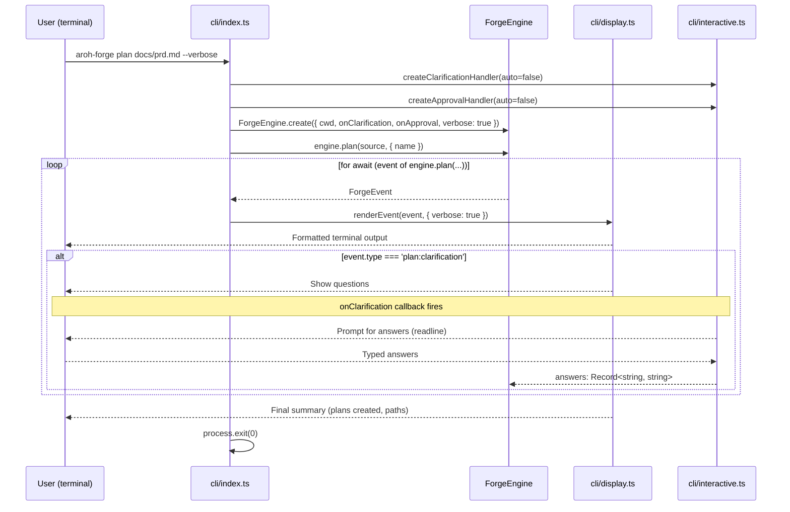
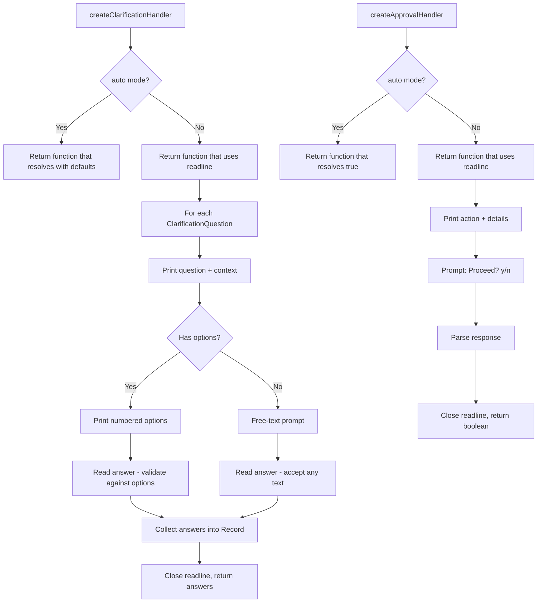

# CLI

## Architecture Reference

This module implements the **cli** layer from the architecture — the thin consumer that wires Commander commands to `ForgeEngine` methods, renders `ForgeEvent`s to stdout via a display module, and handles interactive clarification prompts and approval gates (Wave 4, depends on forge-core).

Key constraints from architecture:
- Engine emits, consumers render — CLI is a pure consumer of `AsyncGenerator<ForgeEvent>`, never reaches into engine internals
- Callbacks for interaction — CLI provides `onClarification` and `onApproval` callback implementations using Node.js `readline` (or `readline/promises`)
- CLI is thin — no business logic, only wiring (Commander → ForgeEngine) and rendering (ForgeEvent → stdout)
- The existing `src/cli.ts` entry point has Commander scaffolding with placeholder actions — this module replaces those placeholders with real engine integration
- Architecture specifies three subfiles: `src/cli/index.ts` (Commander setup), `src/cli/display.ts` (event rendering), `src/cli/interactive.ts` (prompts and gates)
- The entry point (`src/cli.ts`) imports and runs `src/cli/index.ts`
- Flags: `--auto` (bypass approval gates), `--verbose` (stream agent output), `--dry-run` (validate only)

## Scope

### In Scope
- `src/cli/index.ts` — Commander program definition with `plan`, `build`, `review`, and `status` commands, each wiring CLI options to `ForgeEngineOptions` and iterating the engine's event stream through the display renderer
- `src/cli/display.ts` — `ForgeEvent` renderer that formats each event type for terminal output with color-coded severity, progress spinners, and structured summaries
- `src/cli/interactive.ts` — `onClarification` callback (presents questions, collects answers via readline), `onApproval` callback (yes/no prompt with action description), auto-mode stubs that use defaults/auto-approve
- Refactoring the existing `src/cli.ts` entry point to import and run `src/cli/index.ts` (keep it as a thin shebang entry point)
- `--dry-run` support for the `build` command — validates plan set, displays execution plan (waves, dependency order, merge sequence), and exits without running agents
- `--verbose` mode integration — when enabled, display agent-level events (`agent:message`, `agent:tool_use`, `agent:tool_result`); when disabled, only display lifecycle/progress events
- `--auto` mode integration — skip interactive prompts, use default clarification answers, auto-approve all approval gates
- Status command rendering — display current build state from `ForgeEngine.status()` in a formatted table
- Error display — format engine failures, plan failures, merge conflicts with clear error messages and suggested remediation
- Process signal handling — `SIGINT`/`SIGTERM` graceful shutdown (abort active engine operations, flush tracing)
- Exit code management — exit 0 on success, exit 1 on failure, exit 130 on SIGINT

### Out of Scope
- `ForgeEngine` implementation — forge-core module provides this; CLI only instantiates and calls it
- Agent implementations — engine modules handle these
- Event types and data model — foundation module defines `ForgeEvent` and all supporting types
- Config loading — config module handles `forge.yaml` resolution; CLI passes `cwd` and any overrides
- TUI/web UI rendering — future consumers of the same engine
- Event persistence / recording middleware — future enhancement (CLI just iterates the stream)
- `init` command (`aroh-forge init`) — future CLI command that scaffolds `forge.yaml`
- Plugin system / extensibility — out of scope for v1

## Dependencies

| Module | Dependency Type | Notes |
|--------|-----------------|-------|
| forge-core | Hard | `ForgeEngine`, `ForgeEngineOptions` — the sole public API consumed by CLI |
| foundation | Build-time | `ForgeEvent` discriminated union type for exhaustive event rendering, `ForgeStatus`, `ClarificationQuestion`, `ReviewIssue`, `PlanFile` for display formatting |

### External Dependencies

| Package | Version | Purpose |
|---------|---------|---------|
| `commander` | ^14.0.3 | CLI argument parsing and command routing (already in dependencies) |
| `chalk` | ^5.x | Terminal color output for event rendering and status display |
| `ora` | ^8.x | Spinner for long-running operations (planning, building, reviewing) |

New npm dependencies: `chalk` and `ora` (both ESM-only, compatible with the project's ESM setup).

## Implementation Approach

### Overview

Three focused files plus the existing entry point. The CLI module follows a strict separation: `index.ts` owns command definitions and engine wiring, `display.ts` owns all stdout rendering, and `interactive.ts` owns all stdin interaction. The display module renders events via a single `renderEvent()` function that switches on `event.type` — consumers never need to know about event internals beyond the discriminated union.

### Key Decisions

1. **Single `renderEvent()` function with exhaustive switch** — The display module exports one main function that takes a `ForgeEvent` and renders it. Uses TypeScript exhaustive checking (`never` default case) to ensure all event types are handled. This makes it impossible to add a new event type without updating the display.

2. **Spinner lifecycle tied to event pairs** — Start/complete event pairs (`plan:start`/`plan:complete`, `build:start`/`build:complete`, `wave:start`/`wave:complete`, etc.) control spinner state. The display module maintains a `Map<string, Ora>` of active spinners keyed by a composite ID (e.g., `build:${planId}`). Start events create spinners; complete/failed events stop them with success/failure symbols.

3. **Verbose mode is a display concern** — The engine always yields `agent:*` events. The display module filters them out when verbose is disabled. This keeps the engine's behavior consistent regardless of display mode, and lets consumers decide what to show.

4. **Interactive callbacks return promises** — `createClarificationHandler()` and `createApprovalHandler()` return async functions that CLI's Commander actions pass to `ForgeEngineOptions`. In auto mode, these return immediately with defaults. In interactive mode, they use `readline/promises` to prompt the user.

5. **Process exit is explicit** — Commander actions catch errors and call `process.exit(1)`. Successful completion calls `process.exit(0)`. Signal handlers abort the engine's `AbortController` and exit with 130. This ensures clean shutdown and correct exit codes for CI/scripts.

6. **Dry-run is CLI-only logic** — The `--dry-run` flag for `build` validates the plan set and displays the execution plan without creating a `ForgeEngine` instance. It uses foundation's `parseOrchestrationConfig()` and `resolveDependencyGraph()` directly (imported via forge-core's re-exports) to show waves, plan order, and merge sequence.

7. **Status uses synchronous rendering** — `ForgeEngine.status()` is synchronous and returns a `ForgeStatus` object. The CLI renders it immediately as a formatted table — no event stream iteration needed.

8. **Display state is module-scoped** — The display module maintains internal state (active spinners, indentation level for nested events, event counts) in module-scoped variables. This avoids passing display state through every function and keeps the `renderEvent()` signature clean.

9. **Color palette** — Consistent color scheme across all events:
   - Green: success, completion, accepted
   - Red: failure, critical severity, rejected
   - Yellow: warning severity, in-progress, approval needed
   - Blue: informational, start events, agent messages
   - Gray/dim: verbose agent events, timestamps
   - Cyan: plan IDs, branch names, file paths
   - Magenta: wave numbers, merge operations

10. **Readline cleanup** — Interactive readline interfaces are created per prompt and closed immediately after the answer is received. This prevents readline from keeping the event loop alive and blocking process exit.

### CLI Command Flow



### Display Rendering Strategy

```mermaid
graph TD
    A[renderEvent - ForgeEvent] --> B{event.type}

    B -->|forge:start| C[Print banner: command, runId, planSet]
    B -->|forge:end| D[Print summary: status, duration]

    B -->|plan:start| E[Start planner spinner]
    B -->|plan:progress| F[Update spinner text]
    B -->|plan:clarification| G[Stop spinner, print questions]
    B -->|plan:complete| H[Stop spinner with checkmark, list plan files]

    B -->|build:start| I[Start build spinner for planId]
    B -->|build:implement:start| J[Update spinner: implementing...]
    B -->|build:implement:progress| K[Update spinner text with progress]
    B -->|build:implement:complete| L[Spinner succeed: implementation done]
    B -->|build:review:start| M[Start review spinner for planId]
    B -->|build:review:complete| N[Stop spinner, print issue summary]
    B -->|build:evaluate:start| O[Start evaluate spinner]
    B -->|build:evaluate:complete| P[Stop spinner, print accept/reject counts]
    B -->|build:complete| Q[Print plan complete with checkmark]
    B -->|build:failed| R[Print plan failed with X and error]

    B -->|wave:start| S[Print wave header with plan count]
    B -->|wave:complete| T[Print wave complete]

    B -->|merge:start| U[Start merge spinner]
    B -->|merge:complete| V[Spinner succeed: merged]

    B -->|agent:message| W{verbose?}
    W -->|Yes| X[Print dimmed agent message]
    W -->|No| Y[Skip]
    B -->|agent:tool_use| W
    B -->|agent:tool_result| W

    B -->|approval:needed| Z[Print action details, wait for callback]
    B -->|approval:response| AA[Print approved/rejected]
```



### Interactive Prompts



## Files

### Create

- `src/cli/index.ts` — Commander program definition and engine wiring.

  Key exports:
  ```typescript
  /** Create and configure the Commander program with all commands */
  function createProgram(): Command;

  /** Run the CLI — parse args and execute matching command */
  function run(): Promise<void>;
  ```

  Commands:
  - `plan <source>` — options: `--auto`, `--verbose`, `--name <name>`
    - Creates `ForgeEngine` with interactive callbacks
    - Iterates `engine.plan(source, { name })` event stream
    - Renders each event via `renderEvent()`
    - Exits with appropriate code
  - `build <planSet>` — options: `--auto`, `--verbose`, `--dry-run`, `--parallelism <n>`
    - If `--dry-run`: validate and display execution plan, exit
    - Otherwise: creates `ForgeEngine`, iterates `engine.build(planSet, { parallelism })` event stream
    - Renders each event via `renderEvent()`
  - `review <planSet>` — options: `--auto`, `--verbose`
    - Creates `ForgeEngine`, iterates `engine.review(planSet)` event stream
    - Renders each event via `renderEvent()`
  - `status` — no options
    - Creates `ForgeEngine`, calls `engine.status()`
    - Renders `ForgeStatus` via `renderStatus()`

  Signal handling:
  - Register `SIGINT`/`SIGTERM` handlers that call `abortController.abort()` on the active engine operation
  - On signal: stop spinners, print interruption message, exit 130

- `src/cli/display.ts` — Event rendering for terminal output.

  Key exports:
  ```typescript
  interface DisplayOptions {
    verbose: boolean;
  }

  /** Initialize display state (called once per command) */
  function initDisplay(options: DisplayOptions): void;

  /** Render a single ForgeEvent to stdout */
  function renderEvent(event: ForgeEvent): void;

  /** Render ForgeStatus (from status command) */
  function renderStatus(status: ForgeStatus): void;

  /** Render dry-run execution plan */
  function renderDryRun(config: OrchestrationConfig, waves: string[][], mergeOrder: string[]): void;

  /** Stop all active spinners (for cleanup on error/signal) */
  function stopAllSpinners(): void;
  ```

  Internal state:
  - `spinners: Map<string, Ora>` — active spinners keyed by composite ID
  - `verbose: boolean` — whether to render agent-level events
  - `startTime: number` — for computing elapsed time in `forge:end` summary
  - `eventCounts: Record<string, number>` — track event counts for summary

  Event rendering details:
  - `forge:start` — print styled banner with command name, run ID (shortened), plan set name
  - `forge:end` — print summary with status (green checkmark or red X), elapsed time, event counts
  - `plan:start` — start spinner: "Planning from {source}..."
  - `plan:progress` — update spinner text with progress message
  - `plan:clarification` — stop spinner, print each question with context and options (formatted)
  - `plan:clarification:answer` — print answers (dimmed), restart spinner
  - `plan:complete` — stop spinner with success, print list of created plan files with paths
  - `build:start` — start spinner: "Building {planId}..."
  - `build:implement:start` — update spinner: "Implementing {planId}..."
  - `build:implement:progress` — update spinner with progress message
  - `build:implement:complete` — spinner succeed: "Implementation complete: {planId}"
  - `build:review:start` — start spinner: "Reviewing {planId}..."
  - `build:review:complete` — stop spinner, print issue summary by severity (critical/warning/suggestion counts), detail critical issues inline
  - `build:evaluate:start` — start spinner: "Evaluating fixes for {planId}..."
  - `build:evaluate:complete` — spinner succeed: print accept/reject counts in green/red
  - `build:complete` — print plan-level success with checkmark
  - `build:failed` — print plan-level failure with X and error message in red
  - `wave:start` — print wave header: "Wave {n} ({count} plans: {planIds})"
  - `wave:complete` — print wave completion
  - `merge:start` — start spinner: "Merging {planId}..."
  - `merge:complete` — spinner succeed: "Merged {planId}"
  - `agent:message` — if verbose: print dimmed, indented agent message (truncated to terminal width)
  - `agent:tool_use` — if verbose: print dimmed tool name and input summary
  - `agent:tool_result` — if verbose: print dimmed tool result (truncated)
  - `approval:needed` — print action and details in yellow, wait (callback handles interaction)
  - `approval:response` — print approved (green) or rejected (red)

- `src/cli/interactive.ts` — User interaction handlers.

  Key exports:
  ```typescript
  /** Create a clarification handler for the given mode */
  function createClarificationHandler(
    auto: boolean,
  ): (questions: ClarificationQuestion[]) => Promise<Record<string, string>>;

  /** Create an approval handler for the given mode */
  function createApprovalHandler(
    auto: boolean,
  ): (action: string, details: string) => Promise<boolean>;
  ```

  Implementation:
  - **Auto-mode clarification**: return a function that maps each question to its `default` value (or empty string if no default). No readline.
  - **Interactive clarification**: create a `readline/promises` interface, iterate questions:
    - Print question text and context (if any)
    - If options: print numbered list, prompt for selection, validate input
    - If no options: prompt for free-text answer
    - If default: show default in brackets, accept empty input as default
    - Collect all answers into `Record<string, string>`, close readline, return
  - **Auto-mode approval**: return a function that always resolves `true`.
  - **Interactive approval**: create `readline/promises` interface, print action and details, prompt "Proceed? [y/N]", parse response (y/yes = true, everything else = false), close readline, return.

### Modify

- `src/cli.ts` — Refactor from inline Commander setup to import and execute `src/cli/index.ts`:
  ```typescript
  #!/usr/bin/env node
  import { run } from './cli/index.js';
  run();
  ```

## Detailed Design

### Command Wiring Pattern

Each command follows the same pattern — a factory function that creates the `ForgeEngine`, iterates its event stream, and renders events:

```typescript
async function runPlanCommand(source: string, options: { auto?: boolean; verbose?: boolean; name?: string }): Promise<void> {
  const auto = options.auto ?? false;
  const verbose = options.verbose ?? false;

  initDisplay({ verbose });

  const engine = await ForgeEngine.create({
    cwd: process.cwd(),
    auto,
    verbose,
    onClarification: createClarificationHandler(auto),
    onApproval: createApprovalHandler(auto),
  });

  try {
    for await (const event of engine.plan(source, { name: options.name })) {
      renderEvent(event);
    }
    process.exit(0);
  } catch (error) {
    stopAllSpinners();
    console.error(chalk.red(`Fatal error: ${error instanceof Error ? error.message : String(error)}`));
    process.exit(1);
  }
}
```

The build and review commands follow the same structure, with build adding dry-run and parallelism handling:

```typescript
async function runBuildCommand(planSet: string, options: { auto?: boolean; verbose?: boolean; dryRun?: boolean; parallelism?: string }): Promise<void> {
  const auto = options.auto ?? false;
  const verbose = options.verbose ?? false;

  initDisplay({ verbose });

  // Dry-run: validate and display execution plan without running agents
  if (options.dryRun) {
    const configPath = path.join(process.cwd(), 'plans', planSet, 'orchestration.yaml');
    const config = await parseOrchestrationConfig(configPath);
    const { waves, mergeOrder } = resolveDependencyGraph(config.plans);
    renderDryRun(config, waves, mergeOrder);
    process.exit(0);
  }

  const parallelism = options.parallelism ? parseInt(options.parallelism, 10) : undefined;
  const engine = await ForgeEngine.create({
    cwd: process.cwd(),
    auto,
    verbose,
    onClarification: createClarificationHandler(auto),
    onApproval: createApprovalHandler(auto),
  });

  try {
    for await (const event of engine.build(planSet, { parallelism })) {
      renderEvent(event);
    }
    process.exit(0);
  } catch (error) {
    stopAllSpinners();
    console.error(chalk.red(`Fatal error: ${error instanceof Error ? error.message : String(error)}`));
    process.exit(1);
  }
}
```

### Status Rendering

The `renderStatus()` function formats `ForgeStatus` as a terminal-friendly summary:

```typescript
function renderStatus(status: ForgeStatus): void {
  if (!status.running && Object.keys(status.plans).length === 0) {
    console.log(chalk.dim('No active builds.'));
    return;
  }

  console.log(chalk.bold(status.running ? 'Build in progress' : 'Build complete'));
  if (status.setName) {
    console.log(chalk.dim(`Plan set: ${status.setName}`));
  }
  console.log();

  // Plan status table
  const statusIcons: Record<string, string> = {
    pending: chalk.dim('○'),
    running: chalk.yellow('◐'),
    completed: chalk.green('●'),
    failed: chalk.red('✗'),
    blocked: chalk.red('⊘'),
    merged: chalk.green('✓'),
  };

  for (const [planId, planStatus] of Object.entries(status.plans)) {
    const icon = statusIcons[planStatus] ?? chalk.dim('?');
    console.log(`  ${icon} ${chalk.cyan(planId)} — ${planStatus}`);
  }

  if (status.completedPlans.length > 0) {
    console.log();
    console.log(chalk.dim(`Completed: ${status.completedPlans.length}/${Object.keys(status.plans).length} plans`));
  }
}
```

### Dry-Run Rendering

The `renderDryRun()` function shows the execution plan without running it:

```typescript
function renderDryRun(config: OrchestrationConfig, waves: string[][], mergeOrder: string[]): void {
  console.log(chalk.bold('Execution Plan (dry run)'));
  console.log(chalk.dim(`Plan set: ${config.name}`));
  console.log(chalk.dim(`Base branch: ${config.baseBranch}`));
  console.log(chalk.dim(`Mode: ${config.mode}`));
  console.log();

  console.log(chalk.bold('Waves:'));
  for (let i = 0; i < waves.length; i++) {
    console.log(`  ${chalk.magenta(`Wave ${i + 1}`)} (${waves[i].length} plans)`);
    for (const planId of waves[i]) {
      const plan = config.plans.find(p => p.id === planId);
      const deps = plan?.dependsOn.length ? chalk.dim(` ← [${plan.dependsOn.join(', ')}]`) : '';
      console.log(`    ${chalk.cyan(planId)}${deps}`);
    }
  }

  console.log();
  console.log(chalk.bold('Merge order:'));
  for (let i = 0; i < mergeOrder.length; i++) {
    console.log(`  ${chalk.dim(`${i + 1}.`)} ${chalk.cyan(mergeOrder[i])}`);
  }
}
```

### Signal Handling

```typescript
function setupSignalHandlers(abortController: AbortController): void {
  const handler = (signal: string) => {
    stopAllSpinners();
    console.log(); // newline after ^C
    console.log(chalk.yellow(`\nReceived ${signal}. Shutting down gracefully...`));
    abortController.abort();
    // Give the engine a moment to clean up, then force exit
    setTimeout(() => {
      console.log(chalk.red('Forced exit after timeout.'));
      process.exit(130);
    }, 5000);
  };

  process.on('SIGINT', () => handler('SIGINT'));
  process.on('SIGTERM', () => handler('SIGTERM'));
}
```

### Review Issue Display

When `build:review:complete` fires with issues, the display renders a structured summary:

```typescript
function renderReviewIssues(planId: string, issues: ReviewIssue[]): void {
  if (issues.length === 0) {
    console.log(chalk.green(`  ✓ No issues found for ${chalk.cyan(planId)}`));
    return;
  }

  const critical = issues.filter(i => i.severity === 'critical');
  const warnings = issues.filter(i => i.severity === 'warning');
  const suggestions = issues.filter(i => i.severity === 'suggestion');

  const parts: string[] = [];
  if (critical.length > 0) parts.push(chalk.red(`${critical.length} critical`));
  if (warnings.length > 0) parts.push(chalk.yellow(`${warnings.length} warning`));
  if (suggestions.length > 0) parts.push(chalk.dim(`${suggestions.length} suggestion`));

  console.log(`  Review: ${parts.join(', ')}`);

  // Always show critical issues inline
  for (const issue of critical) {
    console.log(chalk.red(`    ✗ [${issue.category}] ${issue.file}${issue.line ? `:${issue.line}` : ''}`));
    console.log(chalk.red(`      ${issue.description}`));
  }
}
```

### Forge Banner

The `forge:start` event renders a minimal banner:

```typescript
function renderForgeStart(event: ForgeEvent & { type: 'forge:start' }): void {
  const shortRunId = event.runId.slice(0, 8);
  console.log();
  console.log(chalk.bold(`aroh-forge ${event.command}`));
  if (event.planSet) {
    console.log(chalk.dim(`Plan set: ${event.planSet}`));
  }
  console.log(chalk.dim(`Run: ${shortRunId} | ${event.timestamp}`));
  console.log();
}
```

## Testing Strategy

No test framework is configured yet. Verification will be done via type-checking and manual validation.

### Type Check
- `pnpm run type-check` must pass with zero errors
- `renderEvent()` must accept all `ForgeEvent` variants (exhaustive switch with `never` default)
- `createClarificationHandler()` return type must match `ForgeEngineOptions['onClarification']`
- `createApprovalHandler()` return type must match `ForgeEngineOptions['onApproval']`

### Manual Validation
- Run `pnpm run dev -- plan docs/init-prd.md --verbose` and verify the engine is created and events stream through the display
- Run `pnpm run dev -- status` and verify it renders "No active builds" when no state file exists
- Run `pnpm run dev -- build forge-v1 --dry-run` and verify it displays the execution plan from `orchestration.yaml`
- Verify `createClarificationHandler(true)` returns defaults without prompting
- Verify `createClarificationHandler(false)` prompts via readline and collects answers
- Verify `createApprovalHandler(true)` resolves `true` without prompting
- Verify `createApprovalHandler(false)` prompts and parses y/n responses
- Verify `SIGINT` during a running command stops spinners and exits with code 130
- Verify all event types render without errors (feed mock events through `renderEvent`)

### Build
- `pnpm run build` must succeed — tsup bundles all new files

## Verification Criteria

- [ ] `pnpm run type-check` passes with zero errors
- [ ] `pnpm run build` produces `dist/cli.js` without errors
- [ ] `src/cli.ts` is refactored to a thin entry point that imports and calls `run()` from `src/cli/index.ts`
- [ ] Commander program defines `plan`, `build`, `review`, and `status` commands with the correct arguments and options
- [ ] `plan` command accepts `<source>` argument and `--auto`, `--verbose`, `--name <name>` options
- [ ] `build` command accepts `<planSet>` argument and `--auto`, `--verbose`, `--dry-run`, `--parallelism <n>` options
- [ ] `review` command accepts `<planSet>` argument and `--auto`, `--verbose` options
- [ ] `status` command takes no arguments
- [ ] Each command creates a `ForgeEngine` via `ForgeEngine.create()` with the appropriate options
- [ ] Each command iterates the engine's `AsyncGenerator<ForgeEvent>` and passes each event to `renderEvent()`
- [ ] `initDisplay()` is called before event iteration to set verbose mode
- [ ] `renderEvent()` handles all `ForgeEvent` type variants via exhaustive switch (TypeScript `never` check)
- [ ] `renderEvent()` skips `agent:*` events when `verbose` is false
- [ ] `renderEvent()` renders `agent:*` events in dimmed/indented format when `verbose` is true
- [ ] `forge:start` renders a banner with command name, shortened run ID, and plan set name
- [ ] `forge:end` renders a summary with status icon (checkmark or X), elapsed time, and result summary
- [ ] `plan:start` starts a spinner with the source identifier
- [ ] `plan:complete` stops the spinner with success and lists created plan files
- [ ] `plan:clarification` stops the spinner and displays questions with context and options
- [ ] `build:start` starts a per-plan spinner
- [ ] `build:implement:*` events update spinner text to show implementation progress
- [ ] `build:review:complete` displays issue summary by severity, with critical issues shown inline
- [ ] `build:evaluate:complete` displays accept/reject counts with color coding
- [ ] `build:complete` displays plan success with checkmark
- [ ] `build:failed` displays plan failure with X and error message in red
- [ ] `wave:start` prints wave header with wave number and plan count
- [ ] `wave:complete` prints wave completion
- [ ] `merge:start` starts a merge spinner
- [ ] `merge:complete` stops the merge spinner with success
- [ ] `approval:needed` displays action and details in yellow
- [ ] `renderStatus()` displays "No active builds" when `ForgeStatus` has no plans
- [ ] `renderStatus()` displays plan status table with icons for each status (pending, running, completed, failed, blocked, merged)
- [ ] `renderDryRun()` displays waves with plan IDs and dependency arrows, and merge order
- [ ] `--dry-run` on `build` command validates plan set and displays execution plan without creating `ForgeEngine` or running agents
- [ ] `createClarificationHandler(true)` returns a function that resolves with default answers without prompting
- [ ] `createClarificationHandler(false)` returns a function that prompts via `readline/promises`, supports both numbered options and free-text input, and respects default values
- [ ] `createApprovalHandler(true)` returns a function that always resolves `true`
- [ ] `createApprovalHandler(false)` returns a function that prompts "Proceed? [y/N]" and parses the response
- [ ] Readline interfaces are created per prompt and closed after use (no dangling event loop handles)
- [ ] `SIGINT` and `SIGTERM` handlers call `stopAllSpinners()`, abort the active engine operation, and exit with code 130
- [ ] Graceful shutdown timeout (5s) forces exit if engine cleanup hangs
- [ ] Successful commands exit with code 0
- [ ] Failed commands exit with code 1
- [ ] `chalk` and `ora` are added to `dependencies` in `package.json`
- [ ] `stopAllSpinners()` is exported and called on error paths and signal handlers
- [ ] All CLI files are bundled correctly by tsup (ESM compatibility with chalk v5 and ora v8)
