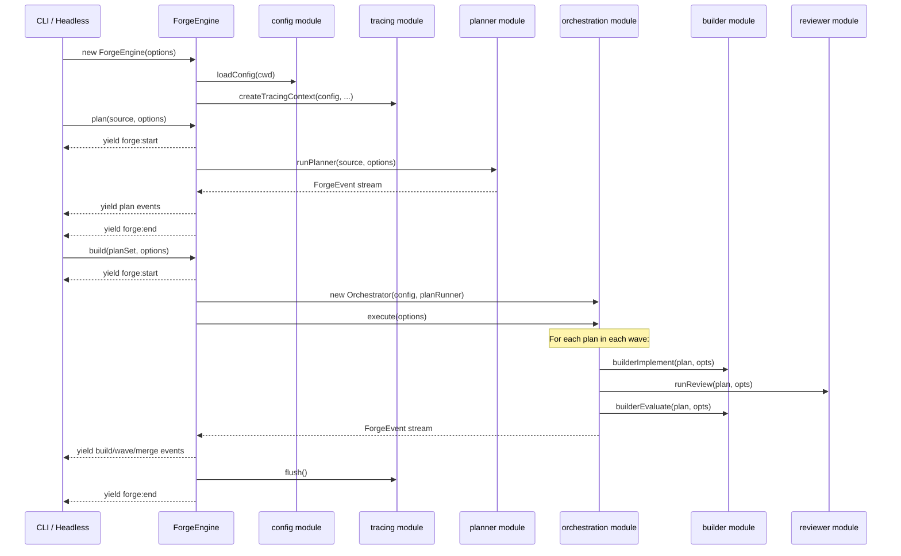
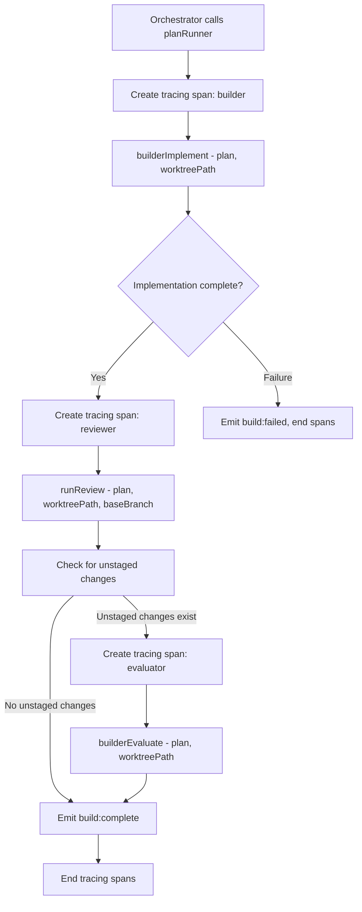
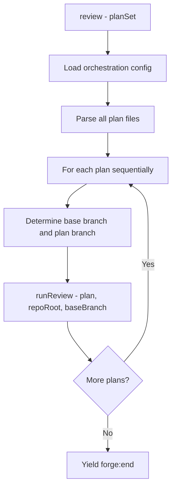

# Forge Core

## Architecture Reference

This module implements the **forge-core** integration layer from the architecture — the `ForgeEngine` class that wires all agents (planner, builder, reviewer) and the orchestrator into a unified API with `plan()`, `build()`, `review()`, and `status()` methods (Wave 3, depends on all Wave 2 agent and orchestration modules).

Key constraints from architecture:
- `ForgeEngine` is the sole public API for consumers — CLI, headless, TUI, and web UI all program against `ForgeEngine`
- All methods return `AsyncGenerator<ForgeEvent>` (except `status()` which is synchronous)
- Engine emits, consumers render — `ForgeEngine` never writes to stdout
- Callbacks for interaction — `onClarification` and `onApproval` are provided by consumers, not baked into the engine
- The engine composes agents and orchestrator — it does not re-implement their logic
- Tracing is initialized here — `ForgeEngine` creates a `TracingContext` from config and passes it to agents
- State management flows through the orchestrator — `ForgeEngine` delegates build state to the `Orchestrator`
- Each engine method wraps its event stream in `forge:start` / `forge:end` lifecycle events

## Scope

### In Scope
- `ForgeEngine` class — the main integration point with `plan()`, `build()`, `review()`, and `status()` methods
- `plan()` method — validates source input, creates a run ID, initializes tracing, delegates to `runPlanner()`, wraps with `forge:start`/`forge:end` lifecycle events, handles clarification callback wiring
- `build()` method — loads orchestration config, constructs the per-plan runner (builder implement -> reviewer -> builder evaluate pipeline), creates `Orchestrator` instance with the plan runner injected, delegates execution, wraps with lifecycle events, flushes tracing on completion
- `review()` method — loads orchestration config, iterates plan files, runs `runReview()` for each plan sequentially, wraps with lifecycle events
- `status()` method — synchronous read of `.forge-state.json` via foundation's `loadState()`, returns `ForgeStatus`
- Per-plan runner function — the callback injected into the `Orchestrator` that sequences builder implement -> reviewer -> builder evaluate for a single plan in a worktree
- Run ID generation — unique identifier per engine invocation for tracing and state correlation
- `ForgeEngineOptions` type — constructor options including `cwd`, `auto`, `verbose`, config overrides, and interaction callbacks
- Tracing lifecycle — create `TracingContext` on engine construction, create trace per method invocation, pass spans to agents, flush on completion
- Error handling — catch agent/orchestrator failures, emit `forge:end` with failure status, ensure tracing flush and cleanup in `finally` blocks
- Re-export of the full public API surface from `src/engine/index.ts`

### Out of Scope
- Agent implementations (planner, builder, reviewer) — provided by their respective modules; forge-core calls them
- Orchestrator implementation — provided by orchestration module; forge-core instantiates and configures it
- Config loading (`loadConfig()`) — provided by config module; forge-core calls it at construction
- Tracing implementation (`createTracingContext()`) — provided by config module; forge-core calls it at construction
- State I/O (`loadState()`, `saveState()`) — provided by foundation module; forge-core delegates through orchestrator
- Plan parsing, event types, SDK mapping — provided by foundation module
- CLI wiring, display rendering, interactive prompts — cli module (the consumer of forge-core)
- Event persistence / recording middleware — future enhancement

## Dependencies

| Module | Dependency Type | Notes |
|--------|-----------------|-------|
| foundation | Hard | `ForgeEvent`, `ForgeState`, `ForgeStatus`, `PlanFile`, `OrchestrationConfig`, `PlanOptions`, `BuildOptions`, `ReviewOptions`, `loadState`, `parseOrchestrationConfig`, `parsePlanFile`, `resolveDependencyGraph`, `validatePlanSet` |
| planner | Hard | `runPlanner()` async generator for the `plan()` method |
| builder | Hard | `builderImplement()`, `builderEvaluate()` async generators for the per-plan runner |
| reviewer | Hard | `runReview()` async generator for the per-plan runner and standalone `review()` method |
| orchestration | Hard | `Orchestrator` class, `OrchestratorOptions`, `PlanRunner` type |
| config | Hard | `loadConfig()`, `ForgeConfig`, `createTracingContext()`, `TracingContext` |

### External Dependencies

| Package | Version | Purpose |
|---------|---------|---------|
| `@anthropic-ai/claude-agent-sdk` | ^0.2.74 | SDK types used in agent option construction |
| `crypto` | (built-in) | `randomUUID()` for run ID generation |

No new npm dependencies required — forge-core is pure integration code.

## Implementation Approach

### Overview

One primary file (`src/engine/forge.ts`) containing the `ForgeEngine` class. The class is constructed with options and a resolved config, then exposes four methods that compose the underlying modules. The key insight is that `ForgeEngine` is thin glue — it owns the lifecycle (run ID, tracing, start/end events) and the composition (wiring agents into the orchestrator's plan runner), but all substantive logic lives in the modules it delegates to.

### Key Decisions

1. **Class, not functions** — `ForgeEngine` is a class because it holds long-lived state: the resolved `ForgeConfig`, the `TracingContext`, the working directory, and interaction callbacks. Methods share this state without parameter drilling. The class is constructed once per CLI invocation.

2. **Config loaded at construction** — `loadConfig(cwd)` is called in the constructor (or a static `create()` factory). This ensures config resolution happens once, before any method is called. Config errors surface early with clear messages.

3. **Per-plan runner is a closure** — The `PlanRunner` callback injected into the `Orchestrator` is created by `build()` as a closure over the engine's config, tracing context, and options. This closure sequences the three-phase pipeline (implement -> review -> evaluate) and yields all events from each phase.

4. **Tracing spans wrap each agent call** — Inside the per-plan runner, each agent invocation (implement, review, evaluate) gets its own tracing span via `TracingContext.createSpan()`. The span records the agent role, plan ID, start/end time, and any errors. This provides per-agent observability without agents needing to know about Langfuse.

5. **`forge:start` and `forge:end` are always emitted** — Every method yields `forge:start` as the first event and `forge:end` as the last, even on failure. The `forge:end` event's `result` field carries the status (`completed` or `failed`) and a human-readable summary. This guarantees consumers can always detect lifecycle boundaries.

6. **Run ID is a UUID** — Generated via `crypto.randomUUID()`. Included in `forge:start`, `forge:end`, and passed to the tracing context. Enables correlation across events, traces, and state files.

7. **`review()` runs sequentially, not through the orchestrator** — Standalone review doesn't need worktrees, dependency resolution, or parallel execution. It iterates plans in order, runs `runReview()` for each, and yields events. This keeps the review path simple and avoids creating worktrees for read-only operations.

8. **`status()` is synchronous** — It reads the state file and transforms it into a `ForgeStatus` summary. No generator needed. Returns immediately. If no state file exists, returns a default "no active builds" status.

9. **Error handling uses try/finally** — Each method wraps its body in a try/catch/finally. Errors are caught, a `forge:end` event with `failed` status is yielded, and the finally block ensures tracing is flushed. This prevents dangling traces and guarantees lifecycle event pairs.

10. **Unstaged change detection between builder and reviewer** — After the reviewer completes, the per-plan runner checks for unstaged changes in the worktree (`git diff --stat`). If no unstaged changes exist (reviewer found no issues or made no fixes), the evaluate phase is skipped entirely. This optimization avoids a wasted SDK call when the reviewer approves the implementation as-is.

### ForgeEngine Lifecycle



### Per-Plan Runner Pipeline

The per-plan runner is the core composition logic. It creates a closure that the orchestrator calls for each plan:



### Standalone Review Flow

The `review()` method takes a simpler path that doesn't involve the orchestrator:



## Files

### Create

- `src/engine/forge.ts` — `ForgeEngine` class, the central integration point.

  Key exports:
  ```typescript
  interface ForgeEngineOptions {
    /** Working directory (default: process.cwd()) */
    cwd?: string;
    /** Auto mode — skip approval gates, use default clarification answers */
    auto?: boolean;
    /** Verbose mode — stream agent-level events to consumer */
    verbose?: boolean;
    /** Clarification callback — called when planner needs user input */
    onClarification?: (questions: ClarificationQuestion[]) => Promise<Record<string, string>>;
    /** Approval callback — called before destructive actions */
    onApproval?: (action: string, details: string) => Promise<boolean>;
    /** Config overrides (merged on top of forge.yaml + env vars) */
    configOverrides?: Partial<ForgeConfig>;
  }

  class ForgeEngine {
    /** Factory method — loads config, initializes tracing */
    static async create(options?: ForgeEngineOptions): Promise<ForgeEngine>;

    /** Generate plan files from a PRD or prompt */
    plan(source: string, options?: Partial<PlanOptions>): AsyncGenerator<ForgeEvent>;

    /** Execute plans — implement, review, evaluate in parallel waves */
    build(planSet: string, options?: Partial<BuildOptions>): AsyncGenerator<ForgeEvent>;

    /** Review existing code against plan specifications */
    review(planSet: string, options?: Partial<ReviewOptions>): AsyncGenerator<ForgeEvent>;

    /** Check current build status (synchronous) */
    status(): ForgeStatus;
  }
  ```

### Modify

- `src/engine/index.ts` — Add re-exports for `ForgeEngine`, `ForgeEngineOptions` from `./forge.js`. This barrel file becomes the single import point for all consumers: `import { ForgeEngine } from './engine/index.js'`

## Detailed Design

### Constructor / `create()` Factory

The constructor is private. Consumers use the async `create()` factory:

```typescript
class ForgeEngine {
  private config: ForgeConfig;
  private tracing: TracingContext;
  private cwd: string;
  private auto: boolean;
  private verbose: boolean;
  private onClarification?: (questions: ClarificationQuestion[]) => Promise<Record<string, string>>;
  private onApproval?: (action: string, details: string) => Promise<boolean>;

  private constructor(
    config: ForgeConfig,
    tracing: TracingContext,
    options: ForgeEngineOptions,
  ) {
    this.config = config;
    this.tracing = tracing;
    this.cwd = options.cwd ?? process.cwd();
    this.auto = options.auto ?? false;
    this.verbose = options.verbose ?? false;
    this.onClarification = options.onClarification;
    this.onApproval = options.onApproval;
  }

  static async create(options: ForgeEngineOptions = {}): Promise<ForgeEngine> {
    const cwd = options.cwd ?? process.cwd();
    const fileConfig = await loadConfig(cwd);
    const config = mergeConfigOverrides(fileConfig, options.configOverrides);
    const tracing = createTracingContext(config);
    return new ForgeEngine(config, tracing, options);
  }
}
```

### `plan()` Method

```typescript
async function* plan(
  source: string,
  options?: Partial<PlanOptions>,
): AsyncGenerator<ForgeEvent> {
  const runId = crypto.randomUUID();
  const timestamp = new Date().toISOString();

  yield { type: 'forge:start', runId, planSet: '', command: 'plan', timestamp };

  try {
    const plannerOpts = {
      cwd: this.cwd,
      verbose: this.verbose,
      auto: this.auto,
      onClarification: this.onClarification,
      abortController: new AbortController(),
      name: options?.name,
      ...options,
    };

    for await (const event of runPlanner(source, plannerOpts)) {
      yield event;
    }

    yield {
      type: 'forge:end',
      runId,
      result: { status: 'completed', summary: 'Planning complete' },
      timestamp: new Date().toISOString(),
    };
  } catch (error) {
    yield {
      type: 'forge:end',
      runId,
      result: {
        status: 'failed',
        summary: `Planning failed: ${error instanceof Error ? error.message : String(error)}`,
      },
      timestamp: new Date().toISOString(),
    };
  } finally {
    await this.tracing.flush();
  }
}
```

### `build()` Method

```typescript
async function* build(
  planSet: string,
  options?: Partial<BuildOptions>,
): AsyncGenerator<ForgeEvent> {
  const runId = crypto.randomUUID();
  const timestamp = new Date().toISOString();

  yield { type: 'forge:start', runId, planSet, command: 'build', timestamp };

  try {
    // Load and validate the plan set
    const configPath = path.join(this.cwd, 'plans', planSet, 'orchestration.yaml');
    const validation = await validatePlanSet(configPath);
    if (!validation.valid) {
      throw new Error(`Invalid plan set: ${validation.errors.join(', ')}`);
    }

    const orchConfig = await parseOrchestrationConfig(configPath);

    // Create the per-plan runner closure — captures baseBranch from orchestration config
    const planRunner: PlanRunner = (planId, worktreePath, plan, buildOpts) => {
      return this.runPlanPipeline(planId, worktreePath, plan, {
        ...buildOpts,
        verbose: this.verbose,
        baseBranch: orchConfig.baseBranch,
      });
    };

    // Create and run the orchestrator
    const stateDir = this.cwd;
    const orchestrator = new Orchestrator(orchConfig, stateDir, this.cwd, planRunner);

    const orchOptions: OrchestratorOptions = {
      auto: this.auto,
      verbose: this.verbose,
      cwd: this.cwd,
      parallelism: options?.parallelism ?? this.config.build.parallelism,
      onApproval: this.onApproval,
    };

    for await (const event of orchestrator.execute(orchOptions)) {
      yield event;
    }

    yield {
      type: 'forge:end',
      runId,
      result: { status: 'completed', summary: `Build complete for plan set: ${planSet}` },
      timestamp: new Date().toISOString(),
    };
  } catch (error) {
    yield {
      type: 'forge:end',
      runId,
      result: {
        status: 'failed',
        summary: `Build failed: ${error instanceof Error ? error.message : String(error)}`,
      },
      timestamp: new Date().toISOString(),
    };
  } finally {
    await this.tracing.flush();
  }
}
```

### `review()` Method

```typescript
async function* review(
  planSet: string,
  options?: Partial<ReviewOptions>,
): AsyncGenerator<ForgeEvent> {
  const runId = crypto.randomUUID();
  const timestamp = new Date().toISOString();

  yield { type: 'forge:start', runId, planSet, command: 'review', timestamp };

  try {
    const configPath = path.join(this.cwd, 'plans', planSet, 'orchestration.yaml');
    const orchConfig = await parseOrchestrationConfig(configPath);

    // Parse each plan file and run review sequentially
    for (const planEntry of orchConfig.plans) {
      const planPath = path.join(this.cwd, 'plans', planSet, `${planEntry.id}.md`);
      const plan = await parsePlanFile(planPath);

      for await (const event of runReview({
        plan,
        worktreePath: this.cwd,
        baseBranch: orchConfig.baseBranch,
        verbose: this.verbose,
        abortController: new AbortController(),
      })) {
        yield event;
      }
    }

    yield {
      type: 'forge:end',
      runId,
      result: { status: 'completed', summary: `Review complete for plan set: ${planSet}` },
      timestamp: new Date().toISOString(),
    };
  } catch (error) {
    yield {
      type: 'forge:end',
      runId,
      result: {
        status: 'failed',
        summary: `Review failed: ${error instanceof Error ? error.message : String(error)}`,
      },
      timestamp: new Date().toISOString(),
    };
  } finally {
    await this.tracing.flush();
  }
}
```

### `status()` Method

```typescript
status(): ForgeStatus {
  const state = loadState(this.cwd);
  if (!state) {
    return {
      running: false,
      plans: {},
      completedPlans: [],
    };
  }

  return {
    running: state.status === 'running',
    setName: state.setName,
    plans: Object.fromEntries(
      Object.entries(state.plans).map(([id, ps]) => [id, ps.status]),
    ),
    completedPlans: state.completedPlans,
  };
}
```

### Per-Plan Runner (`runPlanPipeline`)

This is a private async generator method on `ForgeEngine` that sequences the three-phase pipeline for a single plan:

```typescript
private async function* runPlanPipeline(
  planId: string,
  worktreePath: string,
  plan: PlanFile,
  options: BuildOptions & { verbose?: boolean; baseBranch: string },
): AsyncGenerator<ForgeEvent> {
  yield { type: 'build:start', planId };

  const builderOpts = {
    cwd: worktreePath,
    verbose: options.verbose,
    abortController: new AbortController(),
  };

  // Phase 1: Implement
  const implSpan = this.tracing.createSpan('builder', { planId });
  try {
    for await (const event of builderImplement(plan, builderOpts)) {
      yield event;
    }
    implSpan.end();
  } catch (error) {
    implSpan.error(error instanceof Error ? error : new Error(String(error)));
    yield { type: 'build:failed', planId, error: String(error) };
    return;
  }

  // Phase 2: Blind review
  const reviewSpan = this.tracing.createSpan('reviewer', { planId });
  try {
    for await (const event of runReview({
      plan,
      worktreePath,
      baseBranch: options.baseBranch, // review against the orchestration's base branch (e.g. main)
      verbose: options.verbose,
      abortController: new AbortController(),
    })) {
      yield event;
    }
    reviewSpan.end();
  } catch (error) {
    reviewSpan.error(error instanceof Error ? error : new Error(String(error)));
    // Review failure is non-fatal — implementation is still committed
    // Log but continue without evaluation
    yield { type: 'build:review:complete', planId, issues: [] };
  }

  // Phase 3: Evaluate reviewer fixes (only if unstaged changes exist)
  const hasUnstaged = await this.checkUnstagedChanges(worktreePath);
  if (hasUnstaged) {
    const evalSpan = this.tracing.createSpan('evaluator', { planId });
    try {
      for await (const event of builderEvaluate(plan, builderOpts)) {
        yield event;
      }
      evalSpan.end();
    } catch (error) {
      evalSpan.error(error instanceof Error ? error : new Error(String(error)));
      yield { type: 'build:failed', planId, error: `Evaluation failed: ${String(error)}` };
      return;
    }
  }

  yield { type: 'build:complete', planId };
}
```

### Unstaged Change Detection

A private helper that checks whether the reviewer left unstaged changes in the worktree:

```typescript
private async checkUnstagedChanges(worktreePath: string): Promise<boolean> {
  const { execFile } = await import('node:child_process');
  const { promisify } = await import('node:util');
  const exec = promisify(execFile);

  try {
    const { stdout } = await exec('git', ['diff', '--stat'], { cwd: worktreePath });
    return stdout.trim().length > 0;
  } catch {
    return false;
  }
}
```

### Config Override Merging

A helper function (not exported) that deep-merges consumer-provided overrides on top of the resolved config:

```typescript
function mergeConfigOverrides(
  base: ForgeConfig,
  overrides?: Partial<ForgeConfig>,
): ForgeConfig {
  if (!overrides) return base;

  return {
    langfuse: { ...base.langfuse, ...overrides.langfuse },
    agents: { ...base.agents, ...overrides.agents },
    build: { ...base.build, ...overrides.build },
    plan: { ...base.plan, ...overrides.plan },
  };
}
```

## Testing Strategy

No test framework is configured yet. Verification will be done via type-checking and manual validation.

### Type Check
- `pnpm run type-check` must pass with zero errors
- `ForgeEngine` methods must return the correct types (`AsyncGenerator<ForgeEvent>` for plan/build/review, `ForgeStatus` for status)
- `ForgeEngineOptions` must accept all documented option fields
- `PlanRunner` type from orchestration module must be satisfied by the closure created in `build()`

### Manual Validation
- Import `ForgeEngine` and call `ForgeEngine.create()` with no options — verify it resolves config from cwd and constructs successfully
- Call `engine.status()` with no state file — verify it returns `{ running: false, plans: {}, completedPlans: [] }`
- Call `engine.plan()` and verify it yields `forge:start` as first event and `forge:end` as last event
- Verify the per-plan runner closure correctly sequences `builderImplement` -> `runReview` -> `builderEvaluate`
- Verify `checkUnstagedChanges()` returns false on a clean worktree and true when unstaged diffs exist
- Verify tracing spans are created for each agent phase in the pipeline
- Verify `forge:end` is always emitted even when errors occur

### Build
- `pnpm run build` must succeed — tsup bundles all new files

## Verification Criteria

- [ ] `pnpm run type-check` passes with zero errors
- [ ] `pnpm run build` produces `dist/cli.js` without errors
- [ ] `ForgeEngine.create()` loads config via `loadConfig()`, creates tracing context via `createTracingContext()`, and returns a constructed engine instance
- [ ] `ForgeEngine.create()` accepts `ForgeEngineOptions` with optional `cwd`, `auto`, `verbose`, `onClarification`, `onApproval`, and `configOverrides`
- [ ] `plan()` yields `forge:start` with `command: 'plan'` and a UUID `runId` as the first event
- [ ] `plan()` delegates to `runPlanner()` with composed options including `cwd`, `verbose`, `auto`, and `onClarification` callback
- [ ] `plan()` yields `forge:end` with `status: 'completed'` on success
- [ ] `plan()` yields `forge:end` with `status: 'failed'` on error (never throws)
- [ ] `plan()` flushes tracing in its `finally` block
- [ ] `build()` yields `forge:start` with `command: 'build'` and the plan set name
- [ ] `build()` validates the plan set via `validatePlanSet()` before proceeding
- [ ] `build()` loads the orchestration config via `parseOrchestrationConfig()`
- [ ] `build()` creates an `Orchestrator` instance with a `PlanRunner` closure that sequences the three-phase pipeline
- [ ] `build()` passes `parallelism` from options or config to the orchestrator
- [ ] `build()` yields all events from the orchestrator's `execute()` stream (wave, build, merge events)
- [ ] `build()` yields `forge:end` on completion (success or failure)
- [ ] `build()` flushes tracing in its `finally` block
- [ ] The per-plan runner yields `build:start` as the first event for each plan
- [ ] The per-plan runner calls `builderImplement()` as phase 1, yielding all its events
- [ ] The per-plan runner calls `runReview()` as phase 2 (blind review), yielding all its events
- [ ] The per-plan runner checks for unstaged changes after the reviewer completes
- [ ] The per-plan runner calls `builderEvaluate()` as phase 3 only when unstaged changes exist
- [ ] The per-plan runner skips evaluation when no unstaged changes are detected
- [ ] The per-plan runner yields `build:complete` on successful completion of all phases
- [ ] The per-plan runner yields `build:failed` if the implement phase fails (skips review and evaluate)
- [ ] The per-plan runner treats review failure as non-fatal (implementation commit is preserved)
- [ ] The per-plan runner creates tracing spans for each agent phase (builder, reviewer, evaluator)
- [ ] Tracing spans record errors via `SpanHandle.error()` when agent phases fail
- [ ] `review()` yields `forge:start` with `command: 'review'`
- [ ] `review()` loads orchestration config and parses each plan file
- [ ] `review()` runs `runReview()` sequentially for each plan (no orchestrator, no worktrees)
- [ ] `review()` yields all review events from each plan's review
- [ ] `review()` yields `forge:end` on completion
- [ ] `status()` returns `ForgeStatus` with `running: false` when no state file exists
- [ ] `status()` returns `ForgeStatus` with correct plan statuses when a state file exists
- [ ] `status()` is synchronous (no `async`, no generator)
- [ ] Run ID is a UUID generated via `crypto.randomUUID()`
- [ ] Config overrides are correctly deep-merged on top of file config + env var resolution
- [ ] `ForgeEngine` and `ForgeEngineOptions` are re-exported from `src/engine/index.ts`
- [ ] All error paths yield `forge:end` events — no method ever throws to the consumer
