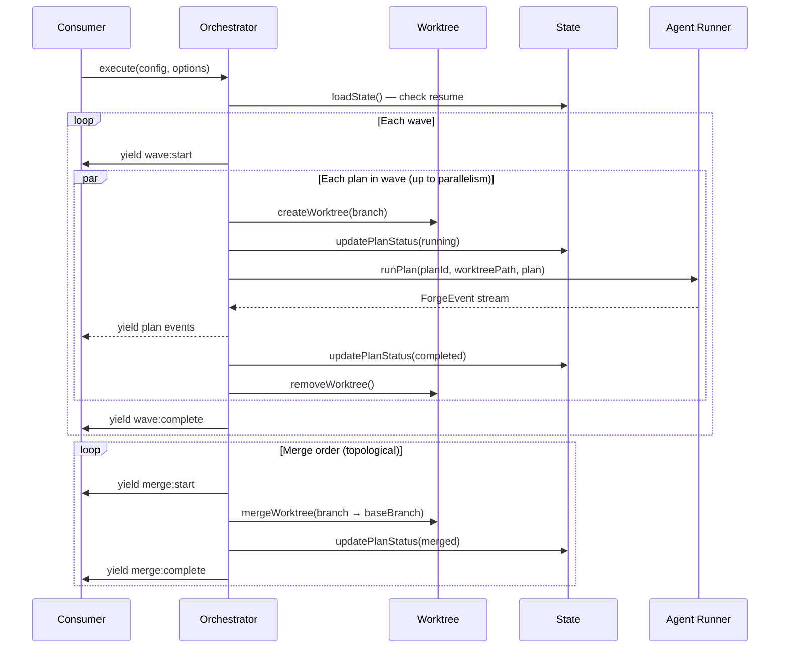

# Orchestration

## Architecture Reference

This module implements the **orchestration** layer from the architecture — dependency graph resolution, wave-based parallel execution, git worktree lifecycle management, and persistent state tracking (Wave 2, parallel with planner/builder/reviewer/config).

Key constraints from architecture:
- Engine emits, consumers render — orchestrator yields `ForgeEvent`s (`wave:start`, `wave:complete`, `merge:start`, `merge:complete`, `build:*`) via `AsyncGenerator`
- Parallel plan execution bounded by `parallelism` option (default: CPU cores)
- Worktrees live in a sibling directory (`../{project}-{set}-worktrees/`) to avoid CLAUDE.md context pollution (ADR-004)
- State file (`.forge-state.json`) enables crash-resume — orchestrator checks state on startup and skips completed plans
- Each plan's work is isolated in a worktree — one plan's failure doesn't corrupt others
- Cleanup runs even on error (try/finally pattern)
- Blocked plans are marked when dependencies fail
- Merge order follows topological sort (dependencies merge first)

## Scope

### In Scope
- `Orchestrator` class — takes an `OrchestrationConfig`, resolves waves, runs plans in parallel within each wave, yields `ForgeEvent`s
- Wave execution loop — iterate waves sequentially, run plans within each wave concurrently up to `parallelism` limit
- Per-plan execution pipeline — create worktree → run builder → run reviewer → evaluate → mark complete (delegates to agent functions)
- Dependency-aware blocking — if a plan fails, mark all transitive dependents as `blocked`
- Resume support — on startup, load `.forge-state.json`, skip plans already `completed` or `merged`, restart `running` plans
- Worktree lifecycle — create, remove, cleanup functions wrapping `git worktree` commands
- Merge sequencing — after all plans in a set complete, merge branches in topological order into the base branch
- Conflict detection — detect merge conflicts, emit error events, halt merge sequence
- State persistence — write `.forge-state.json` after every status transition
- Event multiplexing — interleave `ForgeEvent`s from concurrent plan executions into a single ordered stream
- Parallelism control — concurrency limiter (semaphore) to cap simultaneous plan executions

### Out of Scope
- Agent implementations (planner, builder, reviewer) — those modules provide execution functions; orchestrator calls them
- `ForgeEvent` types, `PlanFile`, `OrchestrationConfig`, `ForgeState` types — defined in foundation module's `events.ts`
- Plan file parsing, dependency graph resolution, state I/O — defined in foundation module's `plan.ts` and `state.ts`
- `ForgeEngine` class integration — forge-core module composes orchestrator with agents
- CLI display rendering — cli module consumes the event stream
- `forge.yaml` configuration — config module

## Dependencies

| Module | Dependency Type | Notes |
|--------|-----------------|-------|
| foundation | build-time | Types (`ForgeEvent`, `OrchestrationConfig`, `ForgeState`, `PlanState`, `PlanFile`, `BuildOptions`), plan parsing (`resolveDependencyGraph`, `parsePlanFile`), state I/O (`loadState`, `saveState`, `updatePlanStatus`, `isResumable`) |

### External Dependencies

| Package | Version | Purpose |
|---------|---------|---------|
| (none beyond foundation's) | - | Worktree operations use Node.js `child_process` (built-in). No new npm dependencies. |

## Implementation Approach

### Overview

Three focused files implementing the orchestration layer. The orchestrator coordinates plan execution across git worktrees, yielding events as plans progress through their lifecycle. It delegates actual agent work to callback functions injected by forge-core, keeping the orchestrator decoupled from agent implementations.

### Key Decisions

1. **Orchestrator receives agent runners as injected functions** — rather than importing agent modules directly, the orchestrator accepts `runPlan: (planId, worktreePath, plan) => AsyncGenerator<ForgeEvent>` callbacks. This avoids circular dependencies and keeps orchestration testable in isolation.
2. **Semaphore-based concurrency control** — a simple counting semaphore limits parallel plan executions. Each plan acquires a slot before starting and releases on completion/failure. Implemented as a class with `acquire()` / `release()` using promise resolution queues.
3. **Event multiplexing via async queue** — concurrent plans push events into a shared async iterable queue. The orchestrator's generator yields from this queue, preserving temporal ordering across parallel plans. Uses a simple push/pull pattern with a buffer and pending resolvers.
4. **Worktree functions are standalone** — `worktree.ts` exports pure functions that shell out to `git worktree add/remove` and `git merge`. No class state. The orchestrator calls them with explicit paths.
5. **State writes are synchronous and atomic** — every status transition writes the full state to `.forge-state.json`. Uses `writeFileSync` with a temp file + rename for atomicity. This matches the foundation module's state API.
6. **Failure propagation is immediate** — when a plan fails, the orchestrator synchronously marks all transitive dependents as `blocked` before continuing with the current wave's remaining plans. Blocked plans never acquire a semaphore slot.
7. **Merge is a separate phase** — all plans must complete before any merging begins. The orchestrator runs merges sequentially in topological order. If a merge fails (conflict), subsequent merges that depend on the failed plan's branch are skipped.
8. **Worktree base directory** is computed as `path.resolve(repoRoot, '..', `${basename}-${setName}-worktrees`)` per ADR-004.

### Execution Flow



## Files

### Create

- `src/engine/orchestrator.ts` — `Orchestrator` class with `execute()` async generator method. Manages wave loop, concurrency, event multiplexing, failure propagation, and merge sequencing. Delegates to worktree functions and agent runner callbacks.

  Key exports:
  ```typescript
  interface OrchestratorOptions extends BuildOptions {
    parallelism?: number;     // Max concurrent plans (default: os.cpus().length)
    worktreeBase?: string;    // Override worktree directory
    onApproval?: (action: string, details: string) => Promise<boolean>;
  }

  type PlanRunner = (
    planId: string,
    worktreePath: string,
    plan: PlanFile,
    options: BuildOptions,
  ) => AsyncGenerator<ForgeEvent>;

  class Orchestrator {
    constructor(
      config: OrchestrationConfig,
      stateDir: string,
      repoRoot: string,
      runPlan: PlanRunner,
    );

    execute(options: OrchestratorOptions): AsyncGenerator<ForgeEvent>;
  }
  ```

- `src/engine/worktree.ts` — Git worktree lifecycle functions. All operations shell out to `git` via `child_process.execFile`.

  Key exports:
  ```typescript
  function createWorktree(repoRoot: string, branch: string, worktreeBase: string): Promise<string>;
  function removeWorktree(repoRoot: string, worktreePath: string): Promise<void>;
  function mergeWorktree(repoRoot: string, branch: string, targetBranch: string): Promise<void>;
  function cleanupWorktrees(repoRoot: string, worktreeBase: string): Promise<void>;
  function computeWorktreeBase(repoRoot: string, setName: string): string;
  ```

- `src/engine/concurrency.ts` — Concurrency primitives for parallel plan execution.

  Key exports:
  ```typescript
  class Semaphore {
    constructor(limit: number);
    acquire(): Promise<void>;
    release(): void;
  }

  class AsyncEventQueue<T> {
    push(item: T): void;
    done(): void;
    [Symbol.asyncIterator](): AsyncIterableIterator<T>;
  }
  ```

### Modify

- `src/engine/index.ts` — Add re-exports for `Orchestrator`, `OrchestratorOptions`, `PlanRunner` from `./orchestrator.js`, worktree functions from `./worktree.js`, and concurrency utilities from `./concurrency.js`

## Implementation Details

### Orchestrator.execute()

The main execution loop:

1. **Load or initialize state** — call `loadState(stateDir)`. If resumable (`isResumable()`), use existing state; otherwise create fresh state from config.
2. **Compute worktree base** — `computeWorktreeBase(repoRoot, config.name)`, create directory if needed.
3. **Resolve waves** — call `resolveDependencyGraph(config.plans)` from foundation to get `{ waves, mergeOrder }`.
4. **Wave loop** — for each wave:
   - Yield `{ type: 'wave:start', wave: i, planIds }`.
   - Filter out plans already `completed`, `merged`, or `blocked`.
   - For each remaining plan, create an async task that:
     a. Acquires semaphore slot.
     b. Creates worktree via `createWorktree()`.
     c. Updates state to `running`.
     d. Iterates the injected `runPlan()` generator, pushing each event to the shared `AsyncEventQueue`.
     e. On success: updates state to `completed`.
     f. On failure: updates state to `failed`, propagates blocks to dependents.
     g. Releases semaphore slot.
     h. Optionally removes worktree (keep on failure for debugging).
   - Consume the `AsyncEventQueue` and yield events to the caller.
   - Wait for all plan tasks to settle.
   - Yield `{ type: 'wave:complete', wave: i }`.
5. **Merge phase** — for each plan in `mergeOrder`:
   - Skip if not `completed` (failed/blocked plans don't merge).
   - Yield `{ type: 'merge:start', planId }`.
   - Call `mergeWorktree(repoRoot, branch, baseBranch)`.
   - Update state to `merged`.
   - Yield `{ type: 'merge:complete', planId }`.
   - On merge failure: yield `build:failed` event, mark as `failed`, propagate blocks.
6. **Cleanup** — in `finally` block, call `cleanupWorktrees()` to prune any remaining worktrees. Save final state.

### Failure Propagation

When a plan fails:
1. Mark the plan as `failed` in state.
2. Walk the dependency graph to find all plans that transitively depend on the failed plan.
3. Mark each dependent as `blocked` in state.
4. Yield `{ type: 'build:failed', planId, error: 'Blocked by failed dependency: <depId>' }` for each blocked plan.

This ensures blocked plans are never scheduled and their status is visible in the event stream.

### Worktree Operations

- **createWorktree**: `git worktree add -b <branch> <worktreePath> <baseBranch>` — creates a new branch from the base. If the branch already exists (resume case), uses `git worktree add <worktreePath> <branch>` instead. Returns the absolute worktree path.
- **removeWorktree**: `git worktree remove --force <worktreePath>` — removes the worktree directory and its git metadata.
- **mergeWorktree**: `git checkout <targetBranch> && git merge --no-ff <branch> -m "forge: merge <branch>"` — merges a plan's branch into the target. Uses `--no-ff` to preserve branch topology. Executed in `repoRoot`.
- **cleanupWorktrees**: `git worktree prune` in the repo root, then `rm -rf <worktreeBase>` if the directory is empty. Called in the finally block.
- **computeWorktreeBase**: `path.resolve(path.dirname(repoRoot), `${path.basename(repoRoot)}-${setName}-worktrees`)`.

### Concurrency Primitives

**Semaphore**: Classic counting semaphore with an internal queue of pending `resolve` functions. `acquire()` returns immediately if slots are available, otherwise returns a promise that resolves when a slot opens. `release()` either resolves the next pending acquirer or increments the available count.

**AsyncEventQueue**: A multi-producer, single-consumer async iterable. Producers call `push(event)` from concurrent plan tasks. The consumer (orchestrator's generator) iterates with `for await...of`. Internally uses a buffer array and a pending resolver. When the queue is empty and all producers are done (`.done()` called), iteration ends. Tracks active producer count via `addProducer()` / `removeProducer()` to know when all producers have finished.

### Event Multiplexing

Concurrent plans within a wave all push events into the same `AsyncEventQueue`. The orchestrator yields events from this queue in the order they arrive (temporal ordering across plans). Each event already carries a `planId` field, so consumers can demux by plan. The queue is created fresh for each wave.

### Resume Logic

On startup, `execute()` calls `loadState()`:
- If no state exists → create fresh `ForgeState` from config, save, proceed normally.
- If state exists and `isResumable()` returns true → reuse state. Plans marked `completed` or `merged` are skipped. Plans marked `running` are reset to `pending` (their previous worktree may be stale). Plans marked `blocked` are re-evaluated (their dependencies may have completed in a previous partial run).
- If state exists and `isResumable()` returns false (status is `completed` or all plans are done) → emit `forge:end` and return.

## Testing Strategy

No test framework is configured yet. Verification will be done via type-checking and manual validation.

### Type Check
- `pnpm run type-check` must pass with zero errors
- `Orchestrator` class must accept `OrchestrationConfig`, `PlanRunner`, and `OrchestratorOptions` without type errors
- All yielded events must conform to `ForgeEvent` discriminated union

### Manual Validation
- Create a mock `PlanRunner` that yields synthetic `build:*` events and verify the orchestrator yields them wrapped in `wave:start/complete` events
- Verify `createWorktree()` and `removeWorktree()` create and clean up worktrees correctly on a test repo
- Verify `mergeWorktree()` performs a `--no-ff` merge
- Verify `Semaphore` limits concurrency (e.g., 2 concurrent acquires with limit 2, third blocks until release)
- Verify `AsyncEventQueue` delivers events in push order and terminates when all producers call `done()`
- Verify resume: create a state file with some plans `completed`, run `execute()`, confirm completed plans are skipped
- Verify failure propagation: mock a plan runner that throws, confirm dependent plans are marked `blocked`

### Build
- `pnpm run build` must succeed — tsup bundles all new files

## Verification Criteria

- [ ] `pnpm run type-check` passes with zero errors
- [ ] `pnpm run build` produces `dist/cli.js` without errors
- [ ] `Orchestrator.execute()` yields `wave:start` and `wave:complete` events in correct wave order
- [ ] Plans within a wave run concurrently up to `parallelism` limit
- [ ] `Semaphore` correctly limits concurrent acquisitions and unblocks on release
- [ ] `AsyncEventQueue` delivers events from multiple producers in temporal order and terminates when all producers finish
- [ ] `createWorktree()` creates a git worktree at the expected sibling path with the correct branch
- [ ] `removeWorktree()` removes the worktree directory and prunes git worktree metadata
- [ ] `mergeWorktree()` performs a `--no-ff` merge of the plan branch into the base branch
- [ ] `cleanupWorktrees()` prunes worktree metadata and removes the worktree base directory
- [ ] `computeWorktreeBase()` returns `../{project}-{setName}-worktrees` path per ADR-004
- [ ] Failed plans propagate `blocked` status to all transitive dependents
- [ ] Blocked plans are never scheduled for execution
- [ ] State is persisted to `.forge-state.json` after every plan status transition
- [ ] Resume: previously `completed` plans are skipped, `running` plans are reset to `pending`
- [ ] Merge phase runs in topological order after all plans complete
- [ ] Merge conflicts are detected and emit `build:failed` events
- [ ] Cleanup runs in `finally` block even when errors occur
- [ ] All exports available via `src/engine/index.ts` barrel
