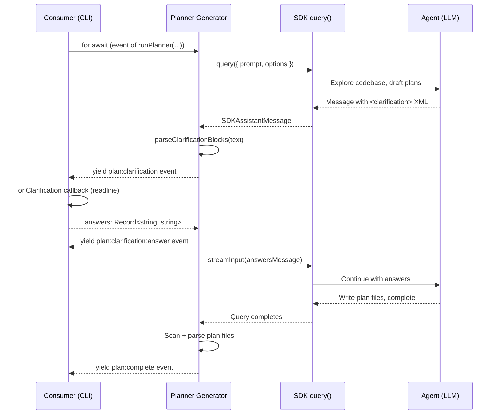

# Planner

## Architecture Reference

This module implements the **planner** agent from the architecture — a one-shot SDK `query()` call that explores the codebase, interacts with the user via `<clarification>` XML blocks, and writes plan files (YAML frontmatter + markdown body). It is a Wave 2 module that depends only on foundation.

Key constraints from architecture:
- Engine emits, consumers render — the planner agent yields `ForgeEvent`s via the common mapper, never writes to stdout
- Planner is a one-shot `query()` call with full tool access (`permissionMode: 'bypassPermissions'`)
- Clarification uses engine-level events parsed from `<clarification>` XML in assistant output (ADR-002), not the SDK's `AskUserQuestion`
- Prompts are static `.md` files loaded at runtime via `loadPrompt()` — no plugin dependencies (ADR-005)
- The planner prompt is extracted and adapted from `schaake-cc-marketplace/eee-plugin/skills/excursion-planner/SKILL.md`
- Plan files follow the `PlanFile` format (YAML frontmatter with `id`, `name`, `depends_on`, `branch`, optional `migrations`; markdown body with Scope, Implementation, Files, Verification sections)
- The planner also writes `orchestration.yaml` alongside the plan files

## Scope

### In Scope
- Planner agent implementation (`src/engine/agents/planner.ts`) — async generator that wraps SDK `query()`, yields `ForgeEvent`s, and handles the clarification pause/resume cycle
- Planner prompt file (`src/engine/prompts/planner.md`) — extracted and adapted from the excursion-planner SKILL.md, tailored for standalone CLI use (no Claude Code plugin context)
- Clarification pause/resume logic — when the SDK stream contains `<clarification>` blocks, the planner pauses its generator, yields `plan:clarification` events, waits for answers via the `onClarification` callback, feeds answers back into the agent via `streamInput()`, and resumes
- Plan file output — the agent writes plan `.md` files and `orchestration.yaml` to disk (via SDK tools); the planner generator emits `plan:complete` with parsed `PlanFile[]` after the agent finishes
- Support for both PRD file paths and inline prompt strings as the `source` argument
- Plan set naming — inferred from source filename or user-provided `--name` flag
- `maxTurns` configuration — sensible default (30) for the one-shot exploration + planning workflow

### Out of Scope
- `ForgeEvent` types, `PlanFile` interface, `ClarificationQuestion` interface — foundation module
- `loadPrompt()`, `parseClarificationBlocks()`, `mapSDKMessages()` — foundation module
- `parsePlanFile()`, `parseOrchestrationConfig()` — foundation module
- `ForgeEngine.plan()` method integration — forge-core module
- CLI rendering of plan events — cli module
- CLI interactive clarification prompts (readline) — cli module
- Builder and reviewer agents — their respective modules

## Dependencies

| Module | Dependency Type | Notes |
|--------|-----------------|-------|
| foundation | hard | All types (`ForgeEvent`, `PlanFile`, `ClarificationQuestion`, `PlanOptions`), utilities (`loadPrompt`, `parseClarificationBlocks`, `mapSDKMessages`, `parsePlanFile`) |

### External Dependencies

| Package | Version | Purpose |
|---------|---------|---------|
| `@anthropic-ai/claude-agent-sdk` | ^0.2.74 | `query()` function, `SDKMessage` types, tool presets |

## Implementation Approach

### Overview

Two files: the agent implementation and its prompt. The agent is an async generator function that composes a prompt from the `.md` template + source content, calls `query()`, iterates the SDK message stream via `mapSDKMessages()`, detects clarification blocks, and handles the pause/resume cycle. The prompt file is a self-contained markdown document extracted from the excursion-planner skill, stripped of all Claude Code plugin context, and adapted for the forge CLI invocation model.

### Key Decisions

1. **Async generator, not a class** — `runPlanner()` is an `async function*` that yields `ForgeEvent`s. No class state needed since the planner is one-shot. The generator's natural pause/resume semantics handle the clarification flow elegantly.

2. **Prompt composition at call time** — `loadPrompt('planner')` returns the base template. The planner composes the final prompt by substituting `{{source}}` (the PRD content or inline prompt), `{{planSetName}}` (inferred or provided name), and `{{cwd}}` (working directory for codebase exploration context).

3. **Clarification is a mid-stream pause** — When `parseClarificationBlocks()` detects questions in an assistant message, the generator yields a `plan:clarification` event and awaits the `onClarification` callback. If no callback (auto mode), questions are skipped and the agent proceeds with its best judgment. If a callback returns answers, they're fed back via `streamInput()` as a follow-up user message.

4. **`streamInput()` for clarification answers** — The SDK's `Query` object supports `streamInput()` to push additional user messages into an active query. This is used to feed clarification answers back to the agent without starting a new query. The planner must use the `AsyncIterable<SDKUserMessage>` prompt form to enable multi-turn interaction.

5. **Plan file discovery after completion** — After the SDK query completes, the planner scans the plan set directory for `.md` files matching the plan format, parses each with `parsePlanFile()`, and yields `plan:complete` with the resulting `PlanFile[]`. This is more robust than trying to parse plan files from the agent's output stream.

6. **Source handling** — If `source` is a file path (exists on disk), read its content and include it in the prompt. If it's an inline string, use it directly. The prompt template has a `{{source}}` placeholder for either case.

7. **AbortController propagation** — The planner accepts an optional `AbortController` (from `PlanOptions` or a parent orchestration) and passes it through to the SDK `query()` call, enabling cancellation.

### Clarification Flow

### Prompt Extraction Strategy

The planner prompt is extracted from `schaake-cc-marketplace/eee-plugin/skills/excursion-planner/SKILL.md` with these adaptations:

1. **Remove plugin context** — No references to `/eee:*` skills, `/orchestrate:*`, worktree `.ports.json`, or Claude Code plugin invocation patterns.
2. **Standalone invocation** — The prompt assumes it's being run by the forge engine, not as a Claude Code skill. It receives the PRD/prompt content directly, not via skill arguments.
3. **Clarification format** — Add explicit instructions for outputting `<clarification>` XML blocks instead of conversational back-and-forth (the engine parses these programmatically).
4. **Plan output directory** — Instruct the agent to write plans to `plans/{planSetName}/` with the standard plan file structure.
5. **Orchestration.yaml generation** — Include instructions for generating the orchestration config alongside plan files.
6. **Complexity assessment** — Retain the complexity assessment logic (errand/excursion/expedition) as guidance for determining the number and granularity of plans, but remove the mode-switching suggestions (forge always generates plans).
7. **Codebase exploration** — Retain the phased exploration strategy (keyword search, pattern identification, impact analysis) as the core planning methodology.

## Files

### Create

- `src/engine/agents/planner.ts` — Planner agent async generator function
  - `runPlanner(source: string, options: PlannerOptions): AsyncGenerator<ForgeEvent>` — main entry point
  - `PlannerOptions` interface extending engine-level `PlanOptions` with internal fields (`cwd`, `abortController`)
  - Prompt composition, SDK `query()` call, message stream iteration
  - Clarification detection, pause/resume, answer injection via `streamInput()`
  - Post-completion plan file discovery and parsing
  - Progress event emission at key milestones (exploring codebase, generating plans, writing files)

- `src/engine/prompts/planner.md` — Planner agent prompt template
  - Role definition: autonomous planning agent for code generation tasks
  - Input section with `{{source}}` placeholder (PRD content or inline prompt)
  - Plan set name: `{{planSetName}}`
  - Working directory: `{{cwd}}`
  - Phased planning strategy (scope understanding, codebase exploration, complexity assessment, plan generation)
  - Clarification format specification (`<clarification>` XML schema with `id`, `question`, `context`, `options`, `default` fields)
  - Plan file format specification (YAML frontmatter + markdown sections)
  - Orchestration.yaml format specification
  - Quality criteria for good plans
  - Output instructions (write files to `plans/{{planSetName}}/`)

### Modify

- `src/engine/index.ts` — Add re-export of `runPlanner` from `agents/planner.js` (barrel update)

## Testing Strategy

No test framework is configured yet. Verification will be done via type-checking and manual validation.

### Type Check
- `pnpm run type-check` must pass with zero errors
- `runPlanner()` return type must be `AsyncGenerator<ForgeEvent>`
- `PlannerOptions` must be compatible with `PlanOptions` from foundation

### Manual Validation
- Import `runPlanner` and verify it composes the prompt correctly (mock source content, check template substitution)
- Verify the clarification pause/resume flow with a mock `onClarification` callback
- Run the planner against a simple prompt in a test repo and verify it produces valid plan files
- Verify `plan:start`, `plan:progress`, `plan:clarification`, `plan:complete` events are emitted in the correct order

### Build
- `pnpm run build` must succeed — tsup bundles the new files

## Verification Criteria

- [ ] `pnpm run type-check` passes with zero errors
- [ ] `pnpm run build` produces `dist/cli.js` without errors
- [ ] `runPlanner()` is an async generator that yields `ForgeEvent`s
- [ ] `runPlanner()` emits `plan:start` as the first event with the source identifier
- [ ] `runPlanner()` calls SDK `query()` with the composed prompt, `permissionMode: 'bypassPermissions'`, `maxTurns: 30`, and `tools: { type: 'preset', preset: 'claude_code' }`
- [ ] `runPlanner()` iterates SDK messages via `mapSDKMessages()` and yields `agent:message`, `agent:tool_use`, `agent:tool_result` events when verbose
- [ ] When `parseClarificationBlocks()` detects `<clarification>` XML in an assistant message, the generator yields `plan:clarification` with parsed `ClarificationQuestion[]`
- [ ] If `onClarification` callback is provided, answers are fed back to the agent via `streamInput()` and a `plan:clarification:answer` event is emitted
- [ ] If no `onClarification` callback (auto mode), clarification is skipped and the agent proceeds
- [ ] After the SDK query completes, the planner scans `plans/{planSetName}/` for plan files, parses each with `parsePlanFile()`, and yields `plan:complete` with `PlanFile[]`
- [ ] `plan:progress` events are emitted at key milestones (e.g., "Exploring codebase", "Generating plans", "Writing plan files")
- [ ] The planner prompt file (`src/engine/prompts/planner.md`) loads successfully via `loadPrompt('planner')`
- [ ] The prompt includes `{{source}}`, `{{planSetName}}`, and `{{cwd}}` template variables
- [ ] The prompt specifies the `<clarification>` XML format matching `ClarificationQuestion` fields
- [ ] The prompt specifies the plan file format matching `PlanFile` structure
- [ ] The prompt includes instructions for generating `orchestration.yaml`
- [ ] `AbortController` is propagated to the SDK `query()` call
- [ ] Source is correctly handled as both file path (read content) and inline string
- [ ] `runPlanner` is re-exported from `src/engine/index.ts`
