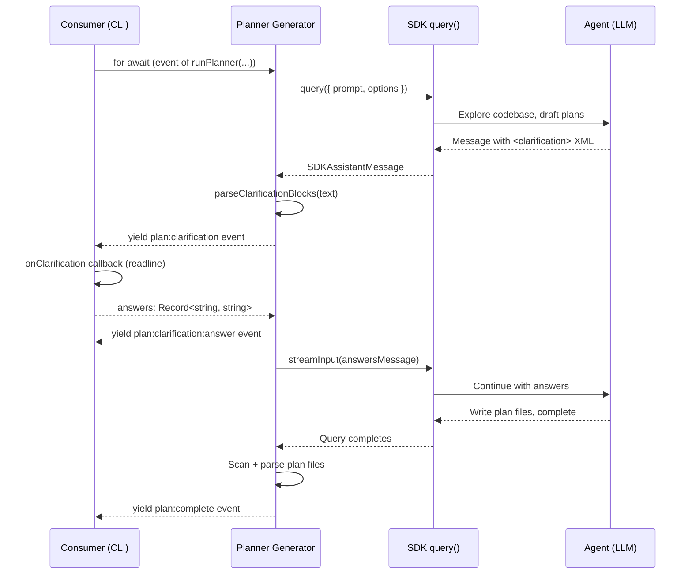

# Planner

## Architecture Context

This module implements the **planner** agent — a one-shot SDK `query()` call that explores the codebase, interacts with the user via `<clarification>` XML blocks, and writes plan files. Wave 2 (parallel with builder, reviewer, orchestration, config).

Key constraints:
- One-shot `query()` with full tool access (`permissionMode: 'bypassPermissions'`)
- Clarification uses engine-level events parsed from `<clarification>` XML (ADR-002), not SDK's `AskUserQuestion`
- Prompts are static `.md` files loaded at runtime via `loadPrompt()` (ADR-005)
- Extracted and adapted from `schaake-cc-marketplace/eee-plugin/skills/excursion-planner/SKILL.md`
- Yields `ForgeEvent`s via `AsyncGenerator` — never writes to stdout

## Implementation

### Overview

Two files: the agent implementation and its prompt. The agent is an async generator function that composes a prompt from the `.md` template + source content, calls `query()`, iterates the SDK message stream via `mapSDKMessages()`, detects clarification blocks, and handles the pause/resume cycle.

### Key Decisions

1. **Async generator, not a class** — `runPlanner()` is an `async function*` that yields `ForgeEvent`s. No class state needed since the planner is one-shot.
2. **Prompt composition at call time** — `loadPrompt('planner')` returns the base template. Substitutes `{{source}}`, `{{planSetName}}`, and `{{cwd}}`.
3. **Clarification is a mid-stream pause** — When `parseClarificationBlocks()` detects questions, the generator yields `plan:clarification` and awaits the `onClarification` callback. Answers fed back via `streamInput()`.
4. **`streamInput()` for clarification answers** — SDK's `Query` object supports pushing additional user messages into an active query.
5. **Plan file discovery after completion** — After the SDK query completes, the planner scans the plan set directory for `.md` files, parses each with `parsePlanFile()`, and yields `plan:complete` with `PlanFile[]`.
6. **Source handling** — File path (read content) or inline string (use directly).
7. **AbortController propagation** — Passed through to SDK `query()` for cancellation.

### Clarification Flow

### Prompt Extraction Strategy

Extracted from `schaake-cc-marketplace/eee-plugin/skills/excursion-planner/SKILL.md` with these adaptations:
1. Remove plugin context — no `/eee:*` skills, `/orchestrate:*`, worktree `.ports.json`
2. Standalone invocation — receives PRD content directly
3. Clarification format — explicit `<clarification>` XML block instructions
4. Plan output directory — write to `plans/{planSetName}/`
5. Orchestration.yaml generation — include alongside plan files
6. Retain complexity assessment logic as guidance
7. Retain phased codebase exploration strategy

## Scope

### In Scope
- `runPlanner(source, options)` async generator wrapping SDK `query()`
- `PlannerOptions` interface
- Clarification pause/resume cycle
- Plan file output (agent writes to disk via SDK tools)
- `plan:complete` with parsed `PlanFile[]`
- Support for both PRD file paths and inline prompts
- Plan set naming (inferred or `--name` flag)

### Out of Scope
- `ForgeEvent` types, `PlanFile`, `ClarificationQuestion` — foundation
- `loadPrompt()`, `parseClarificationBlocks()`, `mapSDKMessages()` — foundation
- `ForgeEngine.plan()` integration — forge-core
- CLI rendering — cli module

## Files

### Create

- `src/engine/agents/planner.ts` — `runPlanner(source, options): AsyncGenerator<ForgeEvent>`, `PlannerOptions` interface
- `src/engine/prompts/planner.md` — Planner prompt template with `{{source}}`, `{{planSetName}}`, `{{cwd}}` variables

### Modify

- `src/engine/index.ts` — Add re-export of `runPlanner` in the `// --- planner ---` section marker (deterministic positioning for clean parallel merges)

## Verification

- [ ] `pnpm run type-check` passes with zero errors
- [ ] `pnpm run build` produces `dist/cli.js` without errors
- [ ] `runPlanner()` is an async generator that yields `ForgeEvent`s
- [ ] `runPlanner()` emits `plan:start` as the first event
- [ ] `runPlanner()` calls SDK `query()` with `permissionMode: 'bypassPermissions'`, `maxTurns: 30`, tools preset
- [ ] `runPlanner()` iterates SDK messages via `mapSDKMessages()` and yields agent events when verbose
- [ ] Clarification blocks detected via `parseClarificationBlocks()` yield `plan:clarification` events
- [ ] `onClarification` callback answers fed back via `streamInput()`, `plan:clarification:answer` emitted
- [ ] Auto mode skips clarification
- [ ] After query, planner scans plan directory, parses files, yields `plan:complete` with `PlanFile[]`
- [ ] `plan:progress` events emitted at key milestones
- [ ] Prompt file loads via `loadPrompt('planner')` with correct template variables
- [ ] Prompt includes `<clarification>` XML format, plan file format, orchestration.yaml format
- [ ] AbortController propagated to SDK `query()`
- [ ] Source handled as both file path and inline string
- [ ] `runPlanner` re-exported from `src/engine/index.ts`
