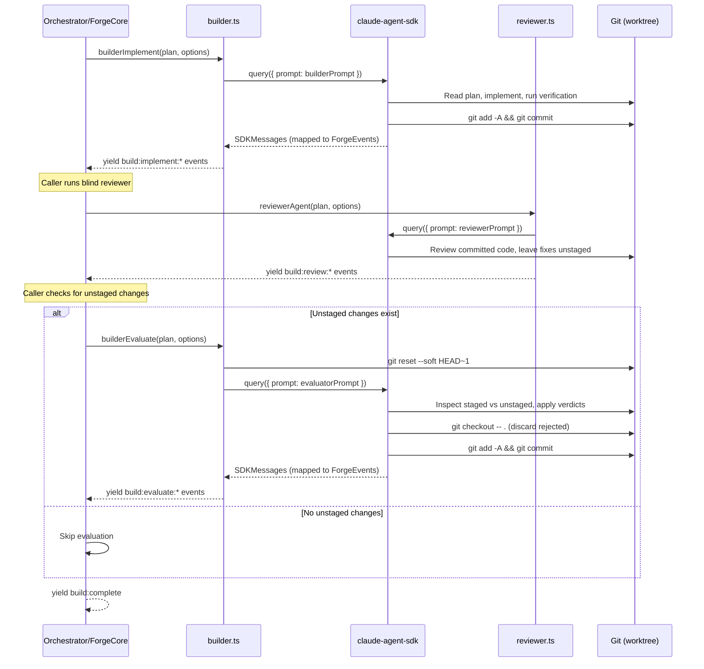

# Builder

## Architecture Context

This module implements the **builder** agent — the multi-turn SDK client that implements plans and evaluates reviewer fixes. Wave 2 (parallel with planner, reviewer, orchestration, config).

Key constraints:
- Two-function design: `builderImplement()` (Turn 1) and `builderEvaluate()` (Turn 2)
- Turn 1: implement plan, commit all changes
- Turn 2: evaluate reviewer's unstaged fixes (accept strict improvements, reject intent-altering changes)
- Between turns: blind reviewer runs separately, then `git reset --soft HEAD~1` creates staged=implementation, unstaged=fixes
- Yields `ForgeEvent`s via `AsyncGenerator` — never writes to stdout
- Prompts are static `.md` files loaded via `loadPrompt()`
- Evaluator uses `<evaluation>` XML for structured verdicts

### Evaluation XML Format

```xml
<evaluation>
  <verdict file="src/api/auth.ts" action="accept">
    Missing null check on user.email — prevents runtime crash
  </verdict>
  <verdict file="src/api/auth.ts" action="reject">
    Refactors error handling strategy — design decision, not a bug
  </verdict>
  <verdict file="src/utils/format.ts" action="review">
    Adds explicit return type — correct but debatable
  </verdict>
</evaluation>
```

### Multi-Turn Lifecycle



## Implementation

### Key Decisions

1. **Builder yields control between turns** — the caller runs the blind reviewer between turns.
2. **Two-function design** — separate queries rather than keeping SDK process alive during review.
3. **Evaluator structured output** — `<evaluation>` XML parsed via `parseEvaluationBlock()`.
4. **Git operations via SDK agent's Bash tool** — evaluator runs `git reset --soft HEAD~1`, applies verdicts, commits.
5. **Self-contained prompts** — plan content interpolated directly, no file path references.
6. **Error handling wraps entire lifecycle** — `build:failed` emitted on failure, worktree left with implementation commit intact.

### Builder Prompt (`builder.md`)

Adapted from orchestrate plugin's executor. Key sections:
1. Context — implementing in a git worktree
2. Plan Content — `{{plan_content}}`
3. Implementation Rules — implement exactly as specified
4. Verification — run verification commands from the plan
5. Commit — single commit: `feat({{plan_id}}): {{plan_name}}`
6. Constraints — no intermediate commits, no out-of-scope changes

### Evaluator Prompt (`evaluator.md`)

Adapted from review plugin's fix-evaluation-policy. Key sections:
1. Context — evaluating fixes from blind reviewer
2. Setup — `git reset --soft HEAD~1`
3. Inspection — compare `git diff --cached` vs `git diff`
4. Policy — full fix-evaluation-policy criteria
5. Actions:
   - Accept: `git add <file>` (stages working tree version with implementation + fix)
   - Reject: `git checkout -- <file>` (discards unstaged fix)
   - Review: treat as reject (conservative)
6. Output — `<evaluation>` XML block
7. Final Commit — `git checkout -- .` to discard remaining, commit

## Scope

### In Scope
- `builderImplement(plan, options)` — Turn 1 async generator
- `builderEvaluate(plan, options)` — Turn 2 async generator
- `parseEvaluationBlock(text)` — XML verdict extraction
- `BuilderOptions`, `EvaluationVerdict` types
- Builder prompt file and evaluator prompt file

### Out of Scope
- Reviewer agent — reviewer module
- Orchestrator/worktree — orchestration module
- ForgeEngine integration — forge-core module

## Files

### Create

- `src/engine/agents/builder.ts` — `builderImplement()`, `builderEvaluate()`, `parseEvaluationBlock()`, `BuilderOptions`, `EvaluationVerdict`
- `src/engine/prompts/builder.md` — Builder implementation prompt (variables: `{{plan_id}}`, `{{plan_name}}`, `{{plan_content}}`, `{{plan_branch}}`)
- `src/engine/prompts/evaluator.md` — Fix evaluation prompt (variables: `{{plan_id}}`, `{{plan_name}}`)

### Modify

- `src/engine/index.ts` — Add re-exports for builder types and functions in the `// --- builder ---` section marker (deterministic positioning for clean parallel merges)

## Verification

- [ ] `pnpm run type-check` passes with zero errors
- [ ] `pnpm run build` produces `dist/cli.js` without errors
- [ ] `builderImplement()` yields `build:implement:start`, agent events (verbose), `build:implement:progress`, `build:implement:complete` in order
- [ ] `builderEvaluate()` yields `build:evaluate:start`, agent events (verbose), `build:evaluate:complete` with accept/reject counts
- [ ] `builderImplement()` SDK query: `cwd` from options, `bypassPermissions`, `maxTurns: 50`, AbortController forwarded
- [ ] `builderEvaluate()` SDK query: `cwd` from options, `bypassPermissions`, `maxTurns: 30`, AbortController forwarded
- [ ] `parseEvaluationBlock()` extracts file, action, reason from `<evaluation>` XML
- [ ] `parseEvaluationBlock()` returns empty array for no XML (graceful degradation)
- [ ] `parseEvaluationBlock()` handles partial/malformed XML without throwing
- [ ] Builder prompt contains all template variables and instructs single-commit workflow
- [ ] Builder prompt instructs verification before commit
- [ ] Evaluator prompt includes `git reset --soft HEAD~1` as first step
- [ ] Evaluator prompt embeds full fix-evaluation-policy
- [ ] Evaluator prompt instructs `<evaluation>` XML output
- [ ] Evaluator prompt instructs `git checkout -- .` after verdicts
- [ ] All exports available via `src/engine/index.ts` barrel
- [ ] SDK messages mapped through `mapSDKMessages()` from foundation
- [ ] AbortController forwarded to SDK `query()`
