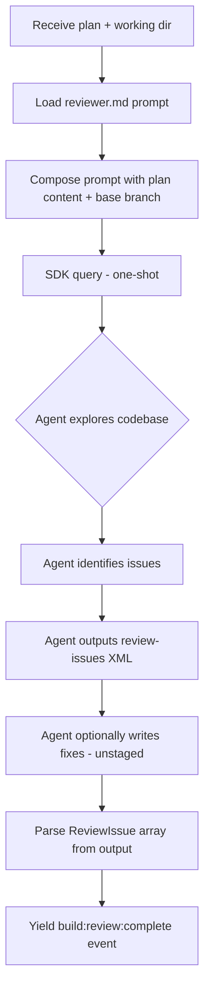

# Reviewer

## Architecture Context

This module implements the **reviewer** agent — a one-shot SDK `query()` that performs blind code review (no builder context), identifies issues with structured severity levels, and leaves fixes unstaged. Wave 2 (parallel with planner, builder, orchestration, config).

Key constraints:
- Blind review — receives plan and committed code but zero knowledge of builder's reasoning
- One-shot `query()` with full tool access (`permissionMode: 'bypassPermissions'`)
- Leaves fixes unstaged — builder's Turn 2 (evaluator) decides what to accept/reject
- Structured `ReviewIssue[]` output via `<review-issues>` XML
- Prompt extracted from schaake-cc-marketplace review plugin

### Review Issue XML Format

```xml
<review-issues>
  <issue severity="critical" category="bug" file="src/auth.ts" line="45">
    Missing null check on user object before accessing email property.
    <fix>Add optional chaining: user?.email</fix>
  </issue>
  <issue severity="warning" category="edge-cases" file="src/utils.ts" line="23">
    No handling for empty array input.
  </issue>
  <issue severity="suggestion" category="performance" file="src/api/list.ts" line="78">
    N+1 query pattern.
    <fix>Use batch query with WHERE id IN (...)</fix>
  </issue>
</review-issues>
```

## Implementation

### Key Decisions

1. **Structured output via XML** — parallels planner's `<clarification>` pattern.
2. **Blind by design** — only plan content + committed code, no builder context.
3. **Git diff scoping** — review only changed files via `git diff` against base branch.
4. **Fixes left unstaged** — agent writes fixes to files but never stages them.
5. **Categories from code-review-policy** — Bugs, Security, Error Handling, Edge Cases, Types, DRY, Performance, Maintainability.
6. **Dual invocation** — inline during build (per-plan in worktree) and standalone via `aroh-forge review`.
7. **`maxTurns: 30`** — enough for file exploration, issue identification, and optional fix writing.

### Reviewer Agent Flow



## Scope

### In Scope
- `runReview(options)` async generator wrapping SDK `query()`
- `parseReviewIssues(text)` — extract `<review-issues>` XML to `ReviewIssue[]`
- `composeReviewPrompt(plan, baseBranch)` — load and template prompt
- `ReviewerOptions` interface
- `reviewer.md` prompt file with review categories, severity mapping, fix instructions

### Out of Scope
- Fix evaluation (accept/reject) — builder module's Turn 2
- Multi-agent parallel review — v1 uses single-agent per plan
- CLI rendering — cli module

## Files

### Create

- `src/engine/agents/reviewer.ts` — `runReview(options)`, `parseReviewIssues(text)`, `composeReviewPrompt()`, `ReviewerOptions`
- `src/engine/prompts/reviewer.md` — Review prompt with `{{plan_content}}`, `{{base_branch}}` variables. Sections: Role, Context, Scope, Review Categories, Severity Mapping, Fix Instructions, Fix Criteria, Output Format, Constraints

### Modify

- `src/engine/index.ts` — Add re-exports for `runReview`, `parseReviewIssues` in the `// --- reviewer ---` section marker (deterministic positioning for clean parallel merges)

## Verification

- [ ] `pnpm run type-check` passes with zero errors
- [ ] `pnpm run build` produces `dist/cli.js` without errors
- [ ] `runReview()` yields `build:review:start` then `build:review:complete` with `ReviewIssue[]`
- [ ] Verbose mode yields `agent:message`, `agent:tool_use`, `agent:tool_result` events
- [ ] `parseReviewIssues()` extracts severity, category, file, line, description, fix from XML
- [ ] `parseReviewIssues()` maps severity to `'critical' | 'warning' | 'suggestion'`
- [ ] `parseReviewIssues()` returns empty array when no XML present
- [ ] `parseReviewIssues()` handles malformed XML without throwing
- [ ] `composeReviewPrompt()` substitutes `{{plan_content}}` and `{{base_branch}}`
- [ ] Prompt contains review categories matching `ReviewIssue` category field
- [ ] Prompt instructs NO staging (no `git add`)
- [ ] Prompt instructs NO committing
- [ ] Prompt scopes review to `git diff` against base branch
- [ ] Prompt instructs `<review-issues>` XML output format
- [ ] SDK query uses `permissionMode: 'bypassPermissions'`, `maxTurns: 30`
- [ ] All exports available via `src/engine/index.ts` barrel
