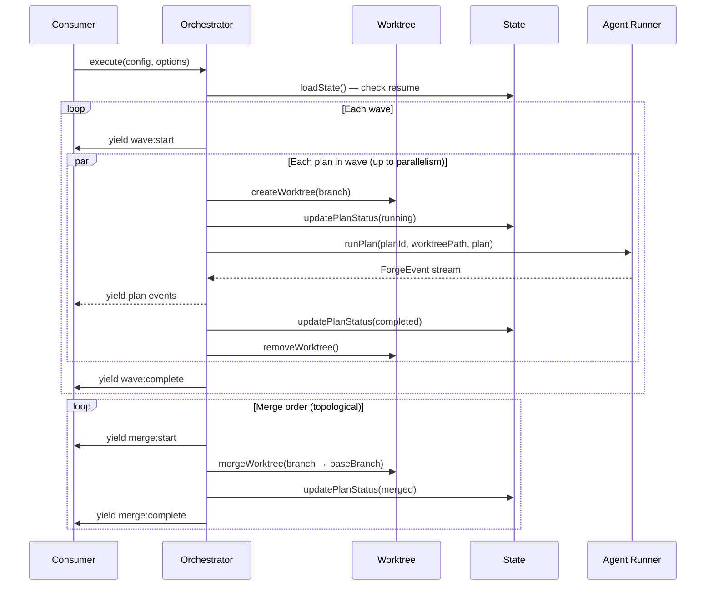

# Orchestration

## Architecture Context

This module implements the **orchestration** layer — dependency graph resolution, wave-based parallel execution, git worktree lifecycle management, and persistent state tracking. Wave 2 (parallel with planner, builder, reviewer, config).

Key constraints:
- Orchestrator yields `ForgeEvent`s (`wave:start`, `wave:complete`, `merge:start`, `merge:complete`, `build:*`)
- Parallel execution bounded by `parallelism` option (default: CPU cores)
- Worktrees in sibling directory `../{project}-{set}-worktrees/` (ADR-004)
- State file (`.forge-state.json`) enables crash-resume
- Isolated worktrees — one plan's failure doesn't corrupt others
- Cleanup in `finally` blocks
- Blocked plans marked on dependency failure
- Merge order follows topological sort

## Implementation

### Key Decisions

1. **Agent runners injected as callbacks** — `PlanRunner` type avoids circular dependencies, keeps orchestration testable.
2. **Semaphore-based concurrency** — counting semaphore limits parallel plans. Promise-based acquire/release.
3. **Event multiplexing via AsyncEventQueue** — multi-producer, single-consumer async iterable. Concurrent plans push events in temporal order.
4. **Standalone worktree functions** — `worktree.ts` exports pure functions wrapping `git worktree` commands.
5. **Synchronous, atomic state writes** — `writeFileSync` with temp file + rename after every status transition.
6. **Immediate failure propagation** — failed plan blocks all transitive dependents before continuing wave.
7. **Merge is a separate phase** — all plans complete before merging. Sequential, topological order, `--no-ff`.
8. **Worktree base** computed as `path.resolve(repoRoot, '..', `${basename}-${setName}-worktrees`)`.

### Execution Flow

### Orchestrator.execute() Flow

1. Load/initialize state — resume or create fresh
2. Compute worktree base — create directory if needed
3. Resolve waves — `resolveDependencyGraph(config.plans)`
4. Wave loop — for each wave: filter out completed/blocked plans, create worktrees, run plans concurrently via semaphore, multiplex events, update state
5. Merge phase — sequential topological merges with `--no-ff`
6. Cleanup — `finally` block prunes worktrees, saves final state

### Failure Propagation

When a plan fails: mark as `failed`, walk dependency graph for transitive dependents, mark each as `blocked`, yield `build:failed` for each blocked plan.

### Resume Logic

On startup: no state → fresh. Resumable state → reuse, skip completed/merged, reset running→pending, re-evaluate blocked. Non-resumable → emit forge:end and return.

## Scope

### In Scope
- `Orchestrator` class with `execute()` async generator
- Wave execution loop with concurrency control
- Per-plan pipeline delegation via injected `PlanRunner` callbacks
- Failure propagation and transitive blocking
- Resume support via `.forge-state.json`
- Worktree lifecycle (create, remove, merge, cleanup, computeBase)
- Merge sequencing (topological, `--no-ff`)
- Event multiplexing (`AsyncEventQueue`)
- `Semaphore` concurrency primitive

### Out of Scope
- Agent implementations — provided by agent modules via PlanRunner
- ForgeEngine wiring — forge-core
- CLI display — cli module

## Files

### Create

- `src/engine/orchestrator.ts` — `Orchestrator` class, `OrchestratorOptions`, `PlanRunner` type
- `src/engine/worktree.ts` — `createWorktree()`, `removeWorktree()`, `mergeWorktree()`, `cleanupWorktrees()`, `computeWorktreeBase()`
- `src/engine/concurrency.ts` — `Semaphore` class, `AsyncEventQueue<T>` class

### Modify

- `src/engine/index.ts` — Add re-exports for Orchestrator, worktree functions, concurrency utilities in the `// --- orchestration ---` section marker (deterministic positioning for clean parallel merges)

## Verification

- [ ] `pnpm run type-check` passes with zero errors
- [ ] `pnpm run build` produces `dist/cli.js` without errors
- [ ] `Orchestrator.execute()` yields `wave:start` and `wave:complete` in correct order
- [ ] Plans within a wave run concurrently up to `parallelism` limit
- [ ] `Semaphore` correctly limits concurrent acquisitions and unblocks on release
- [ ] `AsyncEventQueue` delivers events from multiple producers in temporal order and terminates when all producers finish
- [ ] `createWorktree()` creates a git worktree at the expected sibling path with correct branch
- [ ] `removeWorktree()` removes the worktree directory and prunes metadata
- [ ] `mergeWorktree()` performs `--no-ff` merge into base branch
- [ ] `cleanupWorktrees()` prunes metadata and removes base directory
- [ ] `computeWorktreeBase()` returns `../{project}-{setName}-worktrees` per ADR-004
- [ ] Failed plans propagate `blocked` to all transitive dependents
- [ ] Blocked plans are never scheduled
- [ ] State persisted after every plan status transition
- [ ] Resume: completed plans skipped, running reset to pending
- [ ] Merge phase runs in topological order after all plans complete
- [ ] Merge conflicts detected and emit `build:failed`
- [ ] Cleanup runs in `finally` block even on errors
- [ ] All exports available via `src/engine/index.ts` barrel
