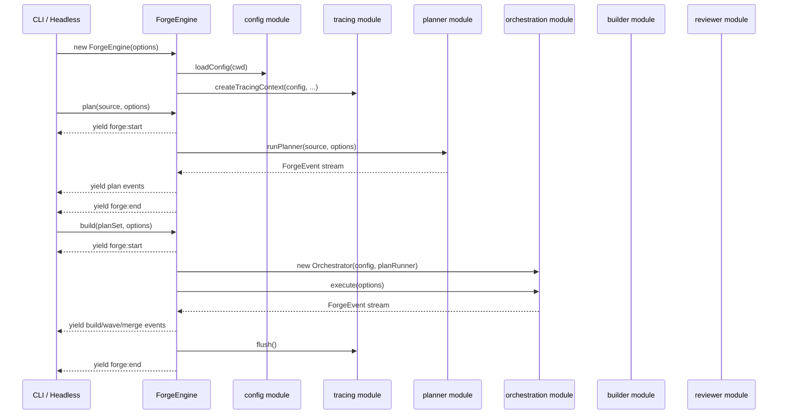
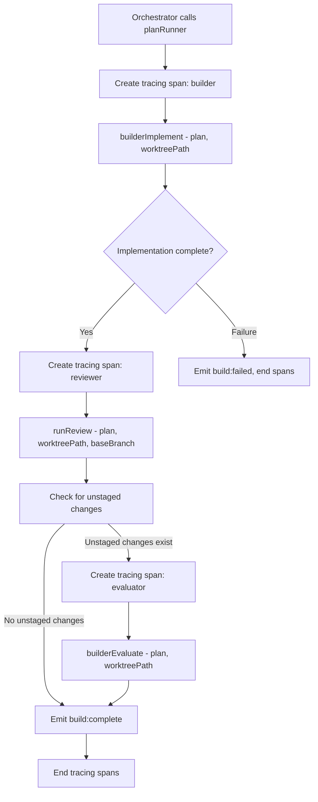

# Forge Core

## Architecture Context

This module implements the **forge-core** integration layer — the `ForgeEngine` class that wires all agents and the orchestrator into a unified API. Wave 3 (depends on all Wave 2 modules).

Key constraints:
- `ForgeEngine` is the sole public API — CLI, headless, TUI, web UI all program against it
- All methods return `AsyncGenerator<ForgeEvent>` (except `status()` which is synchronous)
- Engine emits, consumers render — never writes to stdout
- Callbacks for interaction (`onClarification`, `onApproval`) provided by consumers
- Composes agents and orchestrator — does not re-implement their logic
- Tracing initialized here — `TracingContext` from config passed to agents
- Each method wraps event stream in `forge:start`/`forge:end` lifecycle events

### ForgeEngine Lifecycle



### Per-Plan Runner Pipeline



## Implementation

### Key Decisions

1. **Class, not functions** — holds config, tracing, cwd, callbacks. Constructed once per CLI invocation.
2. **Config loaded at construction** — `ForgeEngine.create()` async factory loads config early.
3. **Per-plan runner is a closure** — captures config, tracing, options. Sequences implement → review → evaluate.
4. **Tracing spans wrap each agent call** — per-agent observability without agents knowing about Langfuse.
5. **`forge:start`/`forge:end` always emitted** — even on failure. Guarantees lifecycle boundaries.
6. **Run ID is a UUID** — `crypto.randomUUID()` for event/trace/state correlation.
7. **`review()` runs sequentially** — no worktrees needed for read-only review.
8. **`status()` is synchronous** — simple state file read.
9. **Error handling uses try/finally** — errors caught, `forge:end` yielded, tracing flushed.
10. **Unstaged change detection** — skip evaluate phase when reviewer made no fixes.

## Scope

### In Scope
- `ForgeEngine` class with `create()`, `plan()`, `build()`, `review()`, `status()`
- `ForgeEngineOptions` type
- Per-plan runner closure (implement → review → evaluate pipeline)
- Run ID generation
- Tracing lifecycle
- Error handling with guaranteed `forge:end` emission
- Config override merging

### Out of Scope
- Agent implementations — agent modules provide these
- Orchestrator implementation — orchestration module
- Config/tracing implementation — config module
- CLI wiring — cli module

## Files

### Create

- `src/engine/forge.ts` — `ForgeEngine` class, `ForgeEngineOptions` interface

  ```typescript
  class ForgeEngine {
    static async create(options?: ForgeEngineOptions): Promise<ForgeEngine>;
    plan(source: string, options?: Partial<PlanOptions>): AsyncGenerator<ForgeEvent>;
    build(planSet: string, options?: Partial<BuildOptions>): AsyncGenerator<ForgeEvent>;
    review(planSet: string, options?: Partial<ReviewOptions>): AsyncGenerator<ForgeEvent>;
    status(): ForgeStatus;
  }
  ```

### Modify

- `src/engine/index.ts` — Add re-exports for `ForgeEngine`, `ForgeEngineOptions` in the `// --- forge-core ---` section marker (deterministic positioning for clean parallel merges)

## Verification

- [ ] `pnpm run type-check` passes with zero errors
- [ ] `pnpm run build` produces `dist/cli.js` without errors
- [ ] `ForgeEngine.create()` loads config, creates tracing context, returns engine
- [ ] `ForgeEngine.create()` accepts all `ForgeEngineOptions` fields
- [ ] `plan()` yields `forge:start` with `command: 'plan'` and UUID `runId`
- [ ] `plan()` delegates to `runPlanner()` with composed options
- [ ] `plan()` yields `forge:end` with `completed` or `failed` status (never throws)
- [ ] `plan()` flushes tracing in `finally` block
- [ ] `build()` yields `forge:start` with `command: 'build'`
- [ ] `build()` validates plan set via `validatePlanSet()`
- [ ] `build()` loads orchestration config
- [ ] `build()` creates `Orchestrator` with `PlanRunner` closure for three-phase pipeline
- [ ] `build()` passes `parallelism` from options or config
- [ ] `build()` yields all orchestrator events
- [ ] `build()` yields `forge:end` (success or failure)
- [ ] `build()` flushes tracing in `finally` block
- [ ] Per-plan runner yields `build:start` first
- [ ] Per-plan runner sequences: `builderImplement` → `runReview` → `builderEvaluate`
- [ ] Per-plan runner checks unstaged changes after review
- [ ] Per-plan runner skips evaluation when no unstaged changes
- [ ] Per-plan runner yields `build:complete` on success
- [ ] Per-plan runner yields `build:failed` if implement fails (skips review/evaluate)
- [ ] Review failure is non-fatal (implementation preserved)
- [ ] Tracing spans created per agent phase
- [ ] `review()` runs `runReview()` sequentially per plan (no orchestrator)
- [ ] `status()` returns `ForgeStatus` synchronously
- [ ] `status()` returns default when no state file exists
- [ ] Run ID is UUID via `crypto.randomUUID()`
- [ ] Config overrides deep-merged correctly
- [ ] `ForgeEngine` and `ForgeEngineOptions` re-exported from barrel
- [ ] All error paths yield `forge:end` — no method throws to consumer
