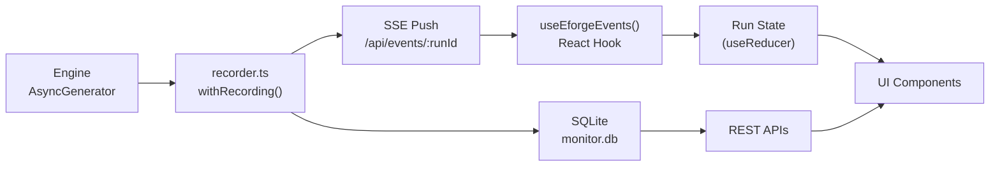
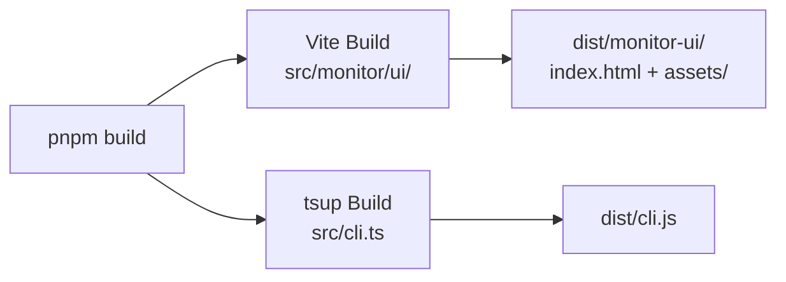

# Monitor Dashboard Architecture

## Vision and Goals

Transform the eforge web monitor from a bare-bones event timeline into a rich, interactive dashboard that visualizes dependency graphs, plan content, wave structure, and merge conflict risk — without changing the monitor's lifecycle model (tied to eforge commands, not a standalone service).

### Goals

1. **Feature parity first** — The React SPA must reproduce every existing feature before adding new ones
2. **Real-time by default** — All visualizations update live via the existing SSE stream
3. **Engine purity preserved** — The engine remains a library with no UI concerns; new data flows through `EforgeEvent`s
4. **Single build artifact** — Vite builds to static assets served by the existing `node:http` server

## Core Architectural Principles

### 1. Event-Driven Data Flow

All monitor state derives from `EforgeEvent`s. No polling, no separate data fetches for live data. The SSE stream is the single source of truth for run progress. Static reference data (orchestration config, plan content) is fetched once via REST endpoints on run selection.



### 2. Server as Static Host + Event Proxy

The `node:http` server's role expands slightly but stays simple:

- **Static assets**: Serve Vite-built files from `dist/monitor-ui/` (JS, CSS, fonts, images)
- **SSE**: Unchanged — `/api/events/:runId` with historical replay
- **REST**: 2-3 new endpoints for orchestration config and plan content (data already in DB)
- **No WebSocket, no GraphQL, no separate dev server in production**

### 3. Component Architecture

React components organized by feature domain, not by atomic design hierarchy:

```
src/monitor/ui/src/
  components/
    layout/          — App shell, sidebar, header
    timeline/        — Event timeline, wave grouping
    pipeline/        — Per-plan pipeline visualization
    graph/           — ReactFlow dependency graph
    preview/         — Plan file preview panel
    heatmap/         — File change heatmap
    common/          — Shared primitives (cards, badges, etc.)
  hooks/             — SSE hook, state management
  lib/               — Utilities, types, API client
```

### 4. State Management

No external state library. React's built-in primitives suffice:

- **`useReducer`** for run state (events accumulate into a derived state object)
- **`useState`** for UI state (selected run, selected plan, panel open/closed)
- **Context** only for cross-cutting concerns (theme, SSE connection)

The reducer processes each `EforgeEvent` into a normalized state shape:

```typescript
interface RunState {
  runId: string;
  status: 'running' | 'completed' | 'failed';
  plans: Map<string, PlanStatus>;
  waves: WaveInfo[];
  events: EforgeEvent[];
  stats: { duration: number; tokens: number; cost: number; eventCount: number };
  orchestration?: OrchestrationConfig;
  planFiles?: Map<string, PlanFileContent>;
  fileChanges?: Map<string, string[]>; // planId → files
}
```

### 5. Build Pipeline Integration



- Vite project lives at `src/monitor/ui/` with its own `package.json`, `vite.config.ts`, and `tsconfig.json`
- `pnpm build` runs both tsup (engine+CLI) and Vite (monitor UI) — order doesn't matter
- tsup's `onSuccess` no longer copies `src/monitor/ui/` wholesale; instead, the Vite build outputs directly to or is copied to `dist/monitor-ui/`
- Dev workflow: `pnpm dev:monitor` runs Vite dev server with proxy to the eforge monitor server for SSE

## Shared Data Model

### Event Types (Engine → Monitor)

One new event type added to the discriminated union:

```typescript
// Added to EforgeEvent union in src/engine/events.ts
{
  type: 'build:files_changed';
  planId: string;
  files: string[];  // Relative file paths from git diff --name-only
}
```

Emitted by the builder agent after `build:implement:complete`, before review. Derived from `git diff --name-only` against the base branch in the worktree.

### REST API Contracts

#### `GET /api/orchestration/:runId`

Returns the `OrchestrationConfig` for a run (extracted from stored `plan:complete` event data).

```typescript
// Response: OrchestrationConfig | null
{
  name: string;
  description: string;
  mode: 'errand' | 'excursion' | 'expedition';
  baseBranch: string;
  plans: Array<{ id: string; name: string; dependsOn: string[]; branch: string }>;
  validate?: string[];
}
```

#### `GET /api/plans/:runId`

Returns plan file content for a run (extracted from stored `plan:complete` event data).

```typescript
// Response: PlanFileContent[]
Array<{
  id: string;
  name: string;
  body: string;  // Full markdown content (YAML frontmatter + body)
}>
```

Both endpoints reconstruct data from the `events` table by finding the `plan:complete` event for the run and extracting the relevant fields from its JSON data. No schema changes needed — the data is already persisted.

### SSE Protocol

Unchanged. Events are JSON-encoded, one per SSE `data:` field, with monotonic integer IDs for replay via `Last-Event-ID`.

## Integration Contracts Between Modules

### engine-events → file-heatmap

The `build:files_changed` event flows through the standard pipeline: engine emits → recorder persists to DB → SSE pushes to client → React reducer updates `fileChanges` map → heatmap component re-renders.

### react-foundation → feature modules (graph, preview, wave-timeline, heatmap)

Foundation provides:
- `useEforgeEvents()` hook — SSE subscription returning accumulated `RunState`
- `useApi()` hook — Fetches REST data (orchestration config, plan content)
- Layout shell with tab/panel system for feature modules to plug into
- shadcn/ui theme and component library
- Common types re-exported from the engine's `events.ts`

Feature modules consume the shared state and render within the layout's content areas. They do not manage their own SSE connections.

### server (foundation) → feature modules (graph, preview)

The 2 new REST endpoints are added in the foundation module. Feature modules call them via the shared `useApi()` hook. No direct server imports in feature code.

## Technical Decisions

### 1. Vite for UI Build (not tsup)

**Rationale**: tsup is optimized for library/CLI bundles. Vite handles SPA concerns (HMR, CSS processing, asset hashing, HTML injection) natively. Keeping them separate avoids fighting tsup's assumptions about entry points.

### 2. ReactFlow for DAG (not D3, not vis.js)

**Rationale**: ReactFlow is React-native (not a wrapper), has built-in support for directed graphs, handles layout via dagre/elkjs, supports custom nodes, and has a well-maintained ecosystem. D3 would require manual React integration. vis.js is heavier and less React-idiomatic.

### 3. shiki for Syntax Highlighting (not Prism, not highlight.js)

**Rationale**: shiki uses VS Code's TextMate grammars for accurate highlighting, supports YAML and markdown natively, works well in React (async loading), and produces pre-highlighted HTML (no runtime parsing). The dark theme aligns with the monitor's aesthetic.

### 4. Monorepo-Style UI Package (not embedded in engine)

**Rationale**: The monitor UI is a separate build target with different dependencies (React, ReactFlow, shiki, Vite). Giving it its own `package.json` within `src/monitor/ui/` keeps dependencies isolated, allows independent version management, and avoids polluting the engine's dependency tree. pnpm workspaces can manage it.

### 5. No External State Library

**Rationale**: The monitor's state model is simple (one active run, events append-only, a few UI toggles). `useReducer` + context handles this without the overhead of Redux/Zustand/Jotai. The reducer pattern naturally maps to the event-sourced data model.

### 6. Server-Side Data Extraction (not client-side event parsing)

**Rationale**: The orchestration config and plan content are embedded in `plan:complete` event JSON. Rather than having the client parse through all events to find this data, the server extracts and serves it via dedicated endpoints. This keeps the client simple and avoids transferring unnecessary data.

## Quality Attributes

### Performance
- Vite build produces optimized, code-split bundles with asset hashing for caching
- SSE events are processed incrementally (no full re-render on each event)
- ReactFlow handles 50+ nodes efficiently (well within expedition scale)
- shiki loads grammars lazily (only YAML + markdown needed)

### Maintainability
- React components are self-contained with clear prop interfaces
- Event-to-state mapping is centralized in the reducer (single place to update when events change)
- Feature modules are independent — adding a new visualization doesn't touch existing ones

### Reliability
- SSE reconnection with replay (existing behavior, preserved in React hook)
- Graceful degradation: graph/heatmap/preview simply don't render if data is missing (errand runs have no waves, no multi-plan data)
- Server continues to work if UI build is missing (returns 404 for assets, no crash)

### Developer Experience
- `pnpm dev:monitor` runs Vite dev server with HMR for rapid UI iteration
- Types shared between engine and UI via direct imports (same monorepo)
- shadcn/ui provides consistent, accessible components without custom CSS
