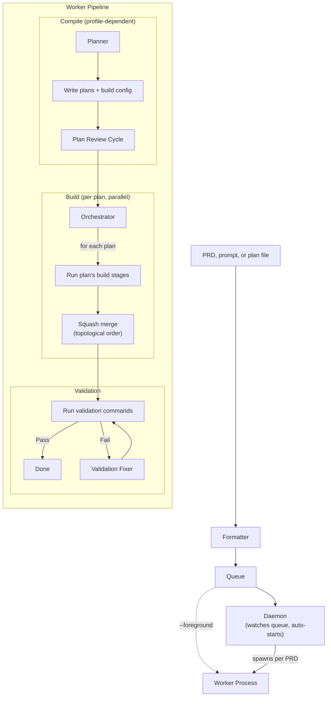

# Update README for Daemon-First Architecture

## Architecture Context

eforge has moved to a daemon-first, queue-centric architecture where `eforge build` delegates to a persistent background daemon by default. The daemon watches the PRD queue, spawns worker processes, and coordinates via SQLite. The README needs to reflect this as the primary execution path.

## Implementation

### Overview

Update five sections of `README.md` to reflect the daemon as the default execution path: the Mermaid diagram, "How It Works" prose, CLI Usage, and Architecture sections. The Claude Code Plugin table is already correct.

### Key Decisions

1. The Mermaid diagram should show two paths (daemon default vs `--foreground`) rather than a single linear flow, so readers understand the daemon is central.
2. Architecture section gets a new paragraph about the daemon — not a full rewrite, just an addition after the existing library-first and monitor paragraphs.
3. CLI Usage additions are minimal: one new command group (`daemon start|stop|status`) and one new flag (`--cleanup/--no-cleanup`).

## Scope

### In Scope
- Replace Mermaid diagram with daemon-aware version showing both execution paths
- Update "How It Works" bullet list to mention daemon as orchestrator between Queue and Build
- Add `eforge daemon start|stop|status` and `--cleanup/--no-cleanup` to CLI Usage section
- Add daemon/MCP proxy/SQLite paragraph to Architecture section

### Out of Scope
- Claude Code Plugin table (already accurate)
- Quick Start section (already mentions daemon at line 45)
- Any file other than `README.md`

## Files

### Modify
- `README.md` — Update Mermaid diagram, "How It Works" bullets, CLI Usage commands/flags, and Architecture section

## Detailed Changes

### 1. Mermaid Diagram (lines 49-77)

Replace the current diagram with one that shows:
- Source → Formatter → Queue (unchanged)
- Daemon watching the queue and spawning workers (new)
- Worker running Compile → Build → Validate (existing subgraphs, reframed as worker responsibility)
- A note showing `--foreground` bypasses daemon

Target diagram structure:


### 2. "How It Works" Bullets (lines 79-81)

Add a new bullet before "Compile" explaining the daemon:

> - **Daemon** - A persistent background process (port 4567) that watches the PRD queue and spawns an isolated worker process for each PRD. The CLI auto-starts the daemon on first use. Use `--foreground` to bypass the daemon and run the pipeline directly.

### 3. CLI Usage Section (lines 89-103)

Add after the existing command list:
```bash
eforge daemon start                  # start persistent daemon
eforge daemon stop                   # stop daemon
eforge daemon status                 # show daemon PID, port, uptime
```

Add `--cleanup/--no-cleanup` to the notable flags sentence:
> `--cleanup/--no-cleanup` (keep or remove plan files after build)

### 4. Architecture Section (lines 109-115)

Add a new paragraph after the monitor paragraph (line 115):

> The daemon is a persistent HTTP server (default port 4567) that watches the PRD queue and auto-builds new entries. Each build spawns an isolated worker process running the same `eforge` binary. The CLI auto-starts the daemon on first `build` invocation and falls back to foreground execution if the daemon is unavailable. An MCP proxy bridges the Claude Code plugin to the daemon's HTTP API, translating tool calls into enqueue and status requests. SQLite (`.eforge/monitor.db`) is the coordination point — the daemon, workers, and web monitor all read/write the same database using WAL mode for concurrent access.

## Verification

- [ ] Mermaid diagram renders in a markdown previewer and shows: Source → Formatter → Queue → Daemon → Worker → Compile/Build/Validate, with a dashed `--foreground` path bypassing the daemon
- [ ] CLI Usage section contains `eforge daemon start`, `eforge daemon stop`, `eforge daemon status` as listed commands
- [ ] CLI Usage section mentions `--cleanup/--no-cleanup` in the notable flags line
- [ ] Architecture section contains a paragraph mentioning: daemon as persistent HTTP server on port 4567, worker spawning, MCP proxy, CLI auto-start with foreground fallback, and SQLite `.eforge/monitor.db` with WAL mode
- [ ] "How It Works" bullet list includes a "Daemon" entry before "Compile"
- [ ] All image paths referenced in README exist on disk: `docs/images/claude-code-handoff.png`, `docs/images/monitor-full-pipeline.png`, `docs/images/monitor-timeline.png`, `docs/images/eval-results.png`
- [ ] All doc links referenced in README exist on disk: `docs/config.md`, `docs/hooks.md`
- [ ] README reads coherently from top to bottom with no contradictory statements
